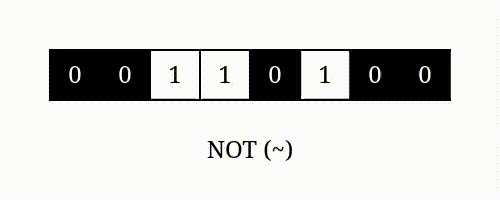
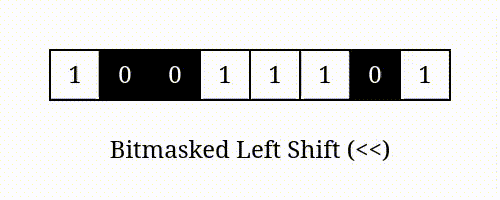
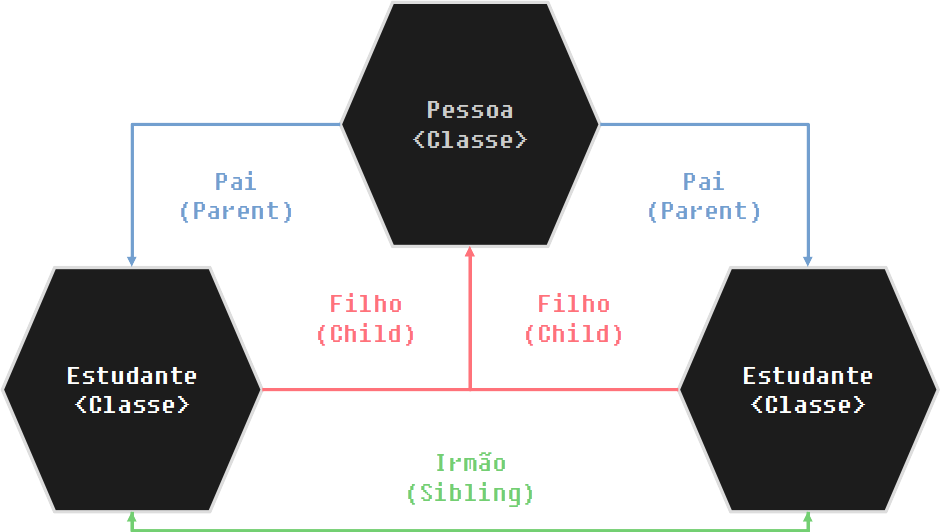

# 0. Python Lessions

Esse arquivo vai conter todas as explicações (meio que um arquivo só com o curso todo) em markdown pois ele é renderizado nos celulares, assim você pode ler em qualquer lugar.

## 0.1. Tabela de Conteudos

- [0. Python Lessions](#0-python-lessions)
  - [0.1. Tabela de Conteudos](#01-tabela-de-conteudos)
- [1. Introdução a Programação](#1-introdução-a-programação)
  - [1.1. O que é programação?](#11-o-que-é-programação)
  - [1.2. Linguagens de programação e suas classificações](#12-linguagens-de-programação-e-suas-classificações)
- [2. Fundamentos Python I](#2-fundamentos-python-i)
  - [2.1. Variaveis, Comentários, print() e input()](#21-variaveis-comentários-print-e-input)
    - [2.1.1. Variaveis](#211-variaveis)
      - [2.1.1.1. Constantes](#2111-constantes)
    - [2.1.2. Comentários](#212-comentários)
      - [2.1.2.1. SheBang (Sistemas UNIX)](#2121-shebang-sistemas-unix)
    - [2.1.3. print()](#213-print)
    - [2.1.4. input()](#214-input)
      - [2.1.4.1. Pequena curiosidade](#2141-pequena-curiosidade)
  - [2.2. Tipos de Dado](#22-tipos-de-dado)
    - [2.2.1. O que é um Dado?](#221-o-que-é-um-dado)
    - [2.2.2. Dados Primitivos](#222-dados-primitivos)
      - [2.2.2.1. String (Textos)](#2221-string-textos)
        - [2.2.2.1.1. Declaração](#22211-declaração)
        - [2.2.2.1.2. Multi-Line](#22212-multi-line)
        - [2.2.2.1.3. fStrings (Formatted Strings)](#22213-fstrings-formatted-strings)
        - [2.2.2.1.4. Concatenação](#22214-concatenação)
      - [2.2.2.2. Numeros (Ints & Floats) e Operações Aritméticas](#2222-numeros-ints--floats-e-operações-aritméticas)
        - [2.2.2.2.1. Ints](#22221-ints)
        - [2.2.2.2.2. Floats](#22222-floats)
        - [2.2.2.2.3. Operações Aritméticas](#22223-operações-aritméticas)
        - [2.2.2.2.4. Divisão](#22224-divisão)
        - [2.2.2.2.5. "Divisão Verdadeira"](#22225-divisão-verdadeira)
      - [2.2.2.3. Problemas com Numeros de Ponto Flutuante](#2223-problemas-com-numeros-de-ponto-flutuante)
        - [2.2.2.3.1. Bit Overflow](#22231-bit-overflow)
        - [2.2.2.3.2. Performance](#22232-performance)
      - [2.2.2.4. Boolean](#2224-boolean)
        - [2.2.2.4.1. Operadores Lógicos](#22241-operadores-lógicos)
        - [2.2.2.4.2. Curto Circuito](#22242-curto-circuito)
      - [2.2.2.5. Curiosidades](#2225-curiosidades)
        - [2.2.2.5.1. Floats](#22251-floats)
        - [2.2.2.5.2. Strings](#22252-strings)
        - [2.2.2.5.3. Prefixos](#22253-prefixos)
        - [2.2.2.5.4. Sequencias de escapagem](#22254-sequencias-de-escapagem)
        - [2.2.2.5.5. Templates](#22255-templates)
        - [2.2.2.5.6. Conversores](#22256-conversores)
        - [2.2.2.5.7. Especificações da Mini-linguagem de formatação](#22257-especificações-da-mini-linguagem-de-formatação)
        - [2.2.2.5.8. Depuração e padrão printf](#22258-depuração-e-padrão-printf)
    - [2.2.3. Tipos Compostos](#223-tipos-compostos)
      - [2.2.3.1. Mutabilidade](#2231-mutabilidade)
      - [2.2.3.2. Tuples](#2232-tuples)
      - [2.2.3.3. Listas](#2233-listas)
        - [2.2.3.3.1. Matrizes (Lista Multi-Dimensional)](#22331-matrizes-lista-multi-dimensional)
      - [2.2.3.4. Sets (Conjuntos)](#2234-sets-conjuntos)
      - [2.2.3.5. Dicionários](#2235-dicionários)
    - [2.2.4. Conversão e Coerção](#224-conversão-e-coerção)
      - [2.2.4.1. Conversão](#2241-conversão)
      - [2.2.4.2. Coerção](#2242-coerção)
    - [2.2.5. `sum()` & `len()`](#225-sum--len)
- [3. Fundamentos Python II](#3-fundamentos-python-ii)
  - [3.1. Tipos de Controle de Flow](#31-tipos-de-controle-de-flow)
    - [3.1.1. Controle de Fluxo (Control Flow) e Escopo](#311-controle-de-fluxo-control-flow-e-escopo)
      - [3.1.1.1. Sequencial](#3111-sequencial)
      - [3.1.1.2. Decisivo](#3112-decisivo)
      - [3.1.1.3. Repetitivo (Recursivo)](#3113-repetitivo-recursivo)
    - [3.1.2. Performance em Loops](#312-performance-em-loops)
      - [3.1.2.1. While Loops](#3121-while-loops)
      - [3.1.2.2. For Loops](#3122-for-loops)
    - [3.1.3. Escopo](#313-escopo)
    - [3.1.4. Desestruturação (Packing & Unpacking)](#314-desestruturação-packing--unpacking)
    - [3.1.5. Desestruturação em `for` loops](#315-desestruturação-em-for-loops)
    - [3.1.6. Iteração em dicionários](#316-iteração-em-dicionários)
    - [3.1.7. `break`, `continue` e `else` em `for` loops](#317-break-continue-e-else-em-for-loops)
    - [3.1.8. Numeros Primos e FizzBuzz](#318-numeros-primos-e-fizzbuzz)
    - [3.1.9. Fatiamento de Listas](#319-fatiamento-de-listas)
      - [3.1.9.1. Ordem Natural](#3191-ordem-natural)
      - [3.1.9.2. Ordem Reversa](#3192-ordem-reversa)
    - [3.1.10. Compreensões (Comprehensions)](#3110-compreensões-comprehensions)
      - [3.1.10.1. Listas](#31101-listas)
      - [3.1.10.2. Listas Condicional](#31102-listas-condicional)
      - [3.1.10.3. Sets](#31103-sets)
      - [3.1.10.4. Dicionários](#31104-dicionários)
    - [3.1.11. A função `zip()`](#3111-a-função-zip)
    - [3.1.12. Funções](#3112-funções)
      - [3.1.12.1. Argumentos e Parametros](#31121-argumentos-e-parametros)
        - [3.1.12.1.1. Parametros Padrões (Valores Padrões)](#311211-parametros-padrões-valores-padrões)
        - [3.1.12.1.2. Argumentos Chave (Nomeados)](#311212-argumentos-chave-nomeados)
        - [3.1.12.1.3. `*args`, `**kwargs`, `*` (Keyword Only Arguments) e `/` (Positional Only Arguments)](#311213-args-kwargs--keyword-only-arguments-e--positional-only-arguments)
      - [3.1.12.2. DocStrings](#31122-docstrings)
      - [3.1.12.3. `return`](#31123-return)
      - [3.1.12.4. Funções lambda](#31124-funções-lambda)
      - [3.1.12.5. Funções de Primeira Classe e Alta Ordem em Python](#31125-funções-de-primeira-classe-e-alta-ordem-em-python)
        - [3.1.12.5.1. Funções de Primeira Classe](#311251-funções-de-primeira-classe)
        - [3.1.12.5.2. Funções de Alta Ordem](#311252-funções-de-alta-ordem)
      - [3.1.12.6. `global` e `nonlocal`](#31126-global-e-nonlocal)
      - [3.1.12.7. `global`](#31127-global)
      - [3.1.12.8. `nonlocal`](#31128-nonlocal)
      - [3.1.12.9. Sombra de variaveis (Variable Shadowing)](#31129-sombra-de-variaveis-variable-shadowing)
      - [3.1.12.10. Operadores](#311210-operadores)
        - [3.1.12.10.1. Aritméticos](#3112101-aritméticos)
        - [3.1.12.10.2. Lógicos](#3112102-lógicos)
        - [3.1.12.10.3. Comparativos](#3112103-comparativos)
        - [3.1.12.10.4. Indentidade](#3112104-indentidade)
        - [3.1.12.10.5. Membro](#3112105-membro)
        - [3.1.12.10.6. Bitwise](#3112106-bitwise)
        - [3.1.12.10.7. AND](#3112107-and)
        - [3.1.12.10.8. OR](#3112108-or)
        - [3.1.12.10.9. XOR](#3112109-xor)
        - [3.1.12.10.10. NOT](#31121010-not)
        - [3.1.12.10.11. LeftShift](#31121011-leftshift)
        - [3.1.12.10.12. RightShift](#31121012-rightshift)
        - [3.1.12.10.13. Bitwise Masking](#31121013-bitwise-masking)
        - [3.1.12.10.14. Associativos](#31121014-associativos)
        - [3.1.12.10.15. Igual](#31121015-igual)
        - [3.1.12.10.16. Mais-Igual](#31121016-mais-igual)
        - [3.1.12.10.17. Associação de expressão (Walrus Operator)](#31121017-associação-de-expressão-walrus-operator)
        - [3.1.12.10.18. Precedencia de Operadores Geral](#31121018-precedencia-de-operadores-geral)
- [4. Programação Orientada a Objetos Básica](#4-programação-orientada-a-objetos-básica)
  - [4.1. Classe, Objetos e Instancias](#41-classe-objetos-e-instancias)
    - [4.1.1. Classes](#411-classes)
    - [4.1.2. Objetos](#412-objetos)
    - [4.1.3. Instancias](#413-instancias)
  - [4.2. Nomeação de parametros](#42-nomeação-de-parametros)
  - [4.3. Metodos Mágicos (Magic Methods/Dunder Methods)](#43-metodos-mágicos-magic-methodsdunder-methods)
    - [4.3.1. `__init__()`](#431-__init__)
    - [4.3.2. `__call__()`](#432-__call__)
    - [4.3.3. `__name__`](#433-__name__)
    - [4.3.4. `__repr__`](#434-__repr__)
  - [4.4. Herança (básica)](#44-herança-básica)
    - [4.4.1. `super()`](#441-super)
    - [4.4.2. `__new__`](#442-__new__)
  - [4.5. Introdução básica a Decoradores](#45-introdução-básica-a-decoradores)
    - [4.5.1. `@property`](#451-property)
    - [4.5.2. Decoradores de metodos `@classmethod` e `@staticmethod`](#452-decoradores-de-metodos-classmethod-e-staticmethod)
      - [4.5.2.1. `@classmethod`](#4521-classmethod)
      - [4.5.2.2. `@staticmethod`](#4522-staticmethod)

# 1. Introdução a Programação

## 1.1. O que é programação?

Programação é a área da ciência e tecnologia especializada na instrução de computadores e sistemas, há também aqueles que defendem que a programação está também associada a arte, vide programação de jogos.

ela é divida em inúmeras áreas, apenas para citar algumas temos:

- Desenvolvimento de Sites

- Desenvolvimento de Jogos

- Desenvolvimento de Aplicativos

- Sistemas e Bancos de dados

- Inteligencias Artificiais

- Algoritmos

_De acordo com a Wikipédia:_

> *"**Programação** é o processo de escrita, teste e manutenção de um* [*programa de computador*](https://pt.wikipedia.org/wiki/Programa_de_computador "Programa de computador"). *O programa é escrito em uma* [*linguagem de programação*](https://pt.wikipedia.org/wiki/Linguagem_de_programa%C3%A7%C3%A3o "Linguagem de programação")*, embora seja possível, com alguma dificuldade, o escrever diretamente em* [*linguagem de máquina*](https://pt.wikipedia.org/wiki/Linguagem_de_m%C3%A1quina "Linguagem de máquina"). *Diferentes partes de um programa podem ser escritas em diferentes linguagens.*
>
> *Diferentes linguagens de programação funcionam de diferentes modos. Por esse motivo, os [programadores](https://pt.wikipedia.org/wiki/Programador "Programador") podem criar programas muito diferentes para diferentes linguagens; muito embora, teoricamente, a maioria das linguagens possa ser usada para criar qualquer programa.*
>
> *Há várias décadas se debate se a programação é mais semelhante a uma* [*arte*](https://pt.wikipedia.org/wiki/Arte "Arte") *(*[*Donald Knuth*](https://pt.wikipedia.org/wiki/Donald_Knuth "Donald Knuth")*), a uma* [*ciência*](https://pt.wikipedia.org/wiki/Ci%C3%AAncia "Ciência")*, à* [*matemática*](https://pt.wikipedia.org/wiki/Matem%C3%A1tica "Matemática") *(*[*Edsger Dijkstra*](https://pt.wikipedia.org/wiki/Edsger_Dijkstra "Edsger Dijkstra")*), à* [*engenharia*](https://pt.wikipedia.org/wiki/Engenharia "Engenharia") *(*[David Parnas](https://pt.wikipedia.org/wiki/David_Parnas "David Parnas")*), ou se é um campo completamente novo."*

Os profissionais da área são conhecidos como programadores ou engenheiros de software, a principal habilidade de um programador é a de resolução de problemas, essencialmente falando, um bom programador é medido não apenas pelo seu conhecimento técnico, mas majoritariamente pela sua habilidade de compreensão e resolução de um problema.

Para atingir tais objetivos, nós os programadores usamos ferramentas como as linguagens de programação, os editores de código, frameworks, entre outros

## 1.2. Linguagens de programação e suas classificações

Linguagens de programação são uma serie de instruções dadas em à maquina em um arquivo comumente conhecido como _"Código Fonte"_, elas possibilitam que o programador/engenheiro de software, transcreva suas  ideias para a linguagem de maquina, criando assim o que chamamos de "software" ou "programa computacional".

_De acordo com a Wikipédia:_

> *"A linguagem de programação é um método padronizado, formado por um conjunto de regras sintáticas e semânticas, de implementação de um código fonte - que pode ser compilado e transformado em um programa de computador, ou usado como script interpretado - que informará instruções de processamento ao computador. Permite que um programador especifique precisamente quais os dados que o computador irá atuar, como estes dados serão armazenados ou transmitidos e, quais ações devem ser tomadas de acordo com as circunstâncias. Linguagens de programação podem ser usadas para expressar algoritmos com precisão."*
>
> _(...)_
>
> *"Uma das principais metas das linguagens de programação é que programadores tenham uma maior produtividade, permitindo expressar suas intenções mais facilmente do que quando comparado com a linguagem que um computador entende nativamente (código de máquina). Assim, linguagens de programação são projetadas para adotar uma sintaxe de nível mais alto, que pode ser mais facilmente entendida por programadores humanos. Linguagens de programação são ferramentas importantes para que programadores e engenheiros de software possam escrever programas mais organizados e com maior rapidez."*

As linguagens podem ser classificadas de acordo com seus paradigmas, método de tradução, tipagem, nível, geração, entre outros, vale também ressaltar que uma linguagem pode ter mais de um tipo de classificação dentro de um mesmo campo.

Uma pequena introdução aos conceitos mais comuns:

- Linguagem de Computação (Matriz): A matriz de uma linguagem define sua utilidade principal, são 3 tipos, Programação (Logica), Marcação (Documentação), Estilo (Design)

  - Programação (Logica): As linguagens de Programação são marcadas por funções e comandos, elas trabalham a logica de maquina, alguns exemplos são, Python e BASH.

  - Marcação (Documentação): As Linguagens de Marcação são marcada pelo uso de marcadores de texto (ex: itálico, negrito, cabeçalhos, etc...), elas são mais usadas na criação de documentos, exemplos seriam MarkDown e HTML (HyperTextMarkupLanguage)

  - Estilo (Design): As Linguagens de Estilo são marcadas pelo o uso de propriedades de aparência (ex: background-color, shadow, etc...), elas são usadas na estilização de sites e aplicativos, exemplos seriam CSS e SASS

- Paradigma:

  - O paradigma de uma linguagem de programação define sua funcionalidade, especificidade, ou orientação, informalmente dizendo, o paradigma de uma linguagem é o equivalente a "uma serie de métodos, dogmas, regras e conceitos que guiam o código fonte"

  - os 3 paradigmas mais comuns são:

    - Imperativa: as etapas são sequenciadas, normalmente de cima abaixo, e os comandos são imperativos, informalmente falando, são ordens que devem ser estritamente seguidas. Linguagens de *scripting* são os melhores exemplos para se descrever Imperatividade, um exemplo com a linguagem BASH:

      - ```shell
        str="Movendo Arquivo1"            # Primeira Instrução
        printf "%s\n" "${str}"            # Segunda Instrução
        mv -vi Arquivo1.ext /diretorio1/  # Terceira Instrução
        printf "%s\n" "Concluido"         # Quarta Instrução
        ```

    - Funcional: as etapas são divididas em blocos de código chamados funções e são executados de acordo com a sua chamada, ou seja, se a função X foi declarada na linha 38 de um programa e a função Y foi declarada na linha 85, sua execução independe da sequencia de declaração (é claro que, as funções não devem ser chamadas antes de suas devidas declarações), resultando em nós podendo chamar a função Y na linha 102 e função X na linha 103, um exemplo seria a linguagem de programação Go:

      - ```go
        package main

        import "fmt"

        // Aqui nós declaramos a primeira função
        func funcao_print_1() {
           fmt.Println("Função 1")
        }

        // Aqui nós declaramos a segunda função
        func funcao_print_2() {
           fmt.Println("Função 2")
        }

        func main() {
           funcao_print_2() // Aqui chamamos a segunda
           funcao_print_1()  // Aqui chamamos a primeira
        }
        ```

        Note a ordem de declaração e de chamada, declaramos a `funcao_print_1` primeiro, e depois a `funcao_print_2`, porém chamamos a `funcao_print_2` antes da `funcao_print_1`

    - Orientada a Objetos: este paradigma segue a interpretação de que os códigos devem ser divididos em objetos (classes), objetos são pequenos contêineres independentes entre si, a orientação a objetos é um campo de estudo deverás complexo, alguns dos seus conceitos como a [Abstração](https://pt.wikipedia.org/wiki/Abstração_(ciência_da_computação)) e a [Ação nos objetos](https://pt.wikipedia.org/wiki/Orientação_a_objetos#Ação_nos_objetos) costumam sempre confundir, você se percebem falando coisas como "o que é um cachorro?", "uma mensagem deveria se auto-mandar, ou ela deveria ser mandada por outra coisa?" e por ai vai. Alguns dos conceitos tratados pela orientação a objeto foram incorporados em outros paradigmas, como as classes. Uma das linguagens orientadas a objetos mais famosas é a Java, aqui um exemplo de código:

      - ```java
        public class Program {
           public static void main(String[] args) throws Exception {
               String str = "Olá Mundo";
               System.out.println(str);
           }
        }
        ```

- Tipagem: ela define a estrutura de tipos, ela essencialmente define a "praticidade" e o "controle" que o programador tem com a linguagem de programação

  - Força: Define a volatilidade da variável na memória, pode ser divida em Fraca ou Forte:

    - Fraca: Linguagens Fracamente Tipadas tem o tipo de suas variáveis mudadas na memória de acordo com a situação

    - Forte: Linguagens Fortemente Tipadas tem seu tipo mantido na memória, uma vez que o mesmo já foi atribuído

  - Estilo: Define a imperatividade da variável, pode ser divido em Estático e Dinâmico:

    - Estático: Linguagens Estaticamente Tipadas, tem o tipo de suas variáveis definido em tempo de compilação, uma diferença nítida é o tipo da variável sendo especificado no código fonte (vide Java)

    - Dinâmico: Linguagens Dinamicamente Tipadas, tem o tipo de suas variáveis definido em tempo de execução, uma diferença seria o tipo da variável sendo omitida no código fonte (vide Python)

      - Exemplo de Estilo:

      - ```
        string texto = "Esse aqui é um texto" # Linguagens Estaticas
        texto = "Esse aqui é um texto"        # Linguagens Dinâmicas
        ```

- Execução: a execução define a forma como o programa é executado, basicamente ela define se podemos executar diretamente o código ou se devemos converter para um executavel, ela é dividida em Interpretadas e Compiladas

  - Linguagens Interpretadas: As linguagens interpretadas tem seu codigo executado em tempo real através do interpretador, essencialmente, basta apenas escrever o codigo e executar, Um exemplo seria a linguagem Python

  - Linguagens Compiladas: As linguagens compiladas tem seu codigo executado após a conversão para um executavel através do compilador, essencialmente após escrevermos o codigo devemos compilar (converter) para um executável (tambem chamado de binário) e enfim executar o programa, um exemplo seria a linguagem C

- Nível: o nível de uma linguagem de programação define sua "humanidade" e "completude", basicamente, quanto mais alto o nível, mais perto da linguagem humana o código fonte é, e mais funções e coisas a linguagem faz de forma "automática", elas podem ser dividas em Baixo e Alto nível

  - Linguagens de Baixo Nível: As linguagens de baixo nível são extremamente próximas do código de maquina (também conhecido como binário), uma das linguagens de mais baixo nível ainda em uso seria a linguagem Assembly, ela trabalha movendo bits para registradores e locais diretos na memoria, um código executado direto no processador, eis aqui um programa que exibe a mensagem "Olá Mundo":

    - ```nasm
      section .data
          str db "Olá Mundo!", 0xA ; Declara a variavel str="Olá Mundo!" e adiciona o LineFeed
          len equ $ - str          ; Coleta o tamanho em bits da variavel

      global _start
      section .text
      _start:
          mov eax, 4              ; Usa o código de operação do kernel SYS_WRITE
          mov ebx, 1              ; Usa o StdIO, nesse caso, usaremos o StdIn
          mov ecx, str            ; Move a variavel str para parametro const_char
          mov edx, len            ; Move o tamanho em bits da variavel para o parametro size_t
          int 0x80                ; Chama o kernel para performar a operação

          mov eax, 1              ; Usa o código de operação do kernel SYS_EXIT
          int 0x80                ; Chama o kernel para performar a operação
      ```

  - Linguagens de Alto Nível: As linguagens de Alto Nível são bem próximas da linguagem humana, e as linguagens acabam por fazer muitas tarefas simples por nós em segundo plano, coisas como limpar a memória em uso, mover os bits para os registradores, entre outras coisas, Linguagens de Alto Nível são amplamente usadas devido a sua praticidade e facilidade de aprendizado e uso, eis aqui um exemplo de programa em Python que exibe a mensagem "Olá Mundo!":

    - ```python
      print("Olá Mundo!")
      ```

Essas classificações simplificam nossa compreensão das linguagens.

# 2. Fundamentos Python I

## 2.1. Variaveis, Comentários, print() e input()

### 2.1.1. Variaveis

A declaração de variaveis em Python é bem simples, basta associar o nome da variavel ao valor desejado, seguindo este modelo:

`{NOME_DA_VARIAVEL} = {VALOR}`

o nome de uma variavel não deve conter espaços, virgulas ou pontos

veja alguns exemplos no bloco de codigo a seguir:


```python
nome = "Mirai"
idade = 17
linguagem = "Python"
```

Também se é possivel associar varios valores a varias variaveis em uma mesma linha, assim como tambem se é possivel associar variaveis a outras variaveis


```python
nome, idade = "Mirai", 17
nome1 = nome
```

#### 2.1.1.1. Constantes

Em programação, constantes são variaveis que não devem ser alteradas durante o programa, vide o nome, elas são CONSTANTES

uma constante em Python é bem parecida com uma variavel em sua declaração, a unica diferença é que uma constante será sempre toda em MAIUSCULO


```python
PI = 3.1415
NUMERO_SEIS = 6
```

### 2.1.2. Comentários

Os comentários são uma funcionalidade das linguagens de programação, eles são linhas que serão ignoradas na execução do código

em Python, os comentários começam com `#`, após isso, tudo será ignorado


```python
# Podemos escrever qualquer coisa que ela não será executada
nome = "Mirai"  # Os comentários não precisam estar no inicio da linha, mas perceba, mesmo que coloquemos um codigo aqui, ele será ignorado
```

Uma das ultilidades dos comentários é, além de comentar e adicionar informações ao codigo, a de "salvar" um codigo, frequentemente você irá se deparar com a seguinte situação:

_"Preciso que este pedaço de codigo não execute, mas não posso apaga-lo pois certamente irei perde-lo, o que devo fazer?"_

A resposta é simples, comente o codigo, isso mesmo, adicione `#` no inicio das linhas, assim o codigo não irá ser executado e você ainda o terá


```python
# nome = "Mirai"
```

#### 2.1.2.1. SheBang (Sistemas UNIX)

Esta parte não tem muito a ver com a linguagem, mas você verá este comentário especial na primeira linha de meus scripts então irei explica-lo

os SheBangs são comentários especiais que começam com `#!` adicionados na primeira linha de um script em sistemas baseados em UNIX (Linux e MacOS)

eles apontam para o executavel a ser usado pelo script, um exemplo seria:

`#!/usr/bin/env python3.10` neste SheBang nós usamos o programa `env` para localizar um executavel para o `python3.10`, dessa forma asseguramos compatibilidade dentre as plataformas UNIX

### 2.1.3. print()

As funções em são reconhecidas pela adição de `()` ao seu final, essas funções, como o nome sugere, performam funções, funcionalidades, ações

a função `print()` é usada quando queremos mostrar algo ao usuário, um exemplo seria:


```python
print("Olá Mundo")  # Aqui Mostramos a mensagem "Olá Mundo"

mensagem = "Tambem funciona com variaveis"

print(
    mensagem
)  # após temos associado a um valor a variavel `mensagem` nós a exibimos ao usuário
```

    Olá Mundo
    Tambem funciona com variaveis


### 2.1.4. input()

A função `input()`, de certa forma é "oposta" a função `print()`, o `input()` serve para pegar uma informação do usuário, enquanto a `print()` serve para exibir


```python
input()  # ao executar este bloco, o programa irá esperar que o usuário aperte a tecla ENTER para enviar a informação digitada
input(
    "Insira seu nome: "
)  # Ao adicionarmos um texto dentro dos parenteses, este texto será exibido antes do cursor do usuário
```


    'Nome Legal'


caso nós queiramos guardar as informações providas pelo `input()`, nós devemos associa-lo a uma variavel


```python
idade = input("Insira sua idade: ")
print("Sua idade é: ", idade)
```

    Sua idade é:  99


#### 2.1.4.1. Pequena curiosidade

nós podemos associar funções a variaveis, e usar as variaveis ao invés da função (mas isso não é recomendado por ser extremamente desnecessario)

exemplo:


```python
imprimir = print

imprimir("Olá mundo")
```

    Olá mundo


## 2.2. Tipos de Dado

### 2.2.1. O que é um Dado?

Dado é tudo aquilo que guarda informação, ou seja, um numero, um texto, Verdadeiro ou Falso, uma letra, qualquer coisa que seja informação

Eles são divididos entre Primitivos (ou Simples, ou Básicos) e Compostos (ou Agrupados, ou Complexos)

### 2.2.2. Dados Primitivos

Dados Primitivos guardam apenas uma informação, ou seja, um numero, um texto, um Verdadeiro

Eles são divididos em 3 tipos:

- Strings (str)
- Integers e Floats (int & float)
- Booleans (bool)

#### 2.2.2.1. String (Textos)

##### 2.2.2.1.1. Declaração

As Strings representam os textos, sua declaração é feita através de aspas duplas ("") ou unicas ('')


```python
nome = "Mirai"
linguagem = "Python"
print(nome, linguagem)
```

    Mirai Python


Nós não podemos misturar as aspas, isto é, começar uma declaração com aspas duplas ("") e terminar com aspas unicas ('')

nós podemos dentro da string usar a aspa que não foi usada durante a declaração, isto se torna util em texto em Ingles


```python
apresentacao = "Hi, my name is Mirai, I'm a Developer"  # Note o uso das aspas unicas dentro da string
citacao = 'Pois então ela disse, "Não se dirija mais a mim"...'  # Note o uso das aspas duplas dentro da string

# repare que envolta do texto usamos o mesmo tipo de aspas
print(apresentacao, citacao)
```

    Hi, my name is Mirai, I'm a Developer Pois então ela disse, "Não se dirija mais a mim"...


porém, nos podemos sim usar o mesmo tipo de aspas dentro e fora da string, basta ultilizarmos o caractere de escapagem (\\)


```python
apresentacao = "Hi, my name is Mirai, I'm a Developer"
citacao = 'Pois então ela disse, "Não se dirija mais a mim"...'
print(apresentacao, citacao)
```

    Hi, my name is Mirai, I'm a Developer Pois então ela disse, "Não se dirija mais a mim"...


##### 2.2.2.1.2. Multi-Line

Tambem temos as "Multi-line Strings", elas são declaradas através de 3 aspas, sejam elas unicas ou duplas, elas são textos que se espalham por multiplas linhas, preservando espaços


```python
multi_line1 = """Olá, eu sou um texto de multiplas linhasl, eu fui declarado usando aspas duplas \"\"

  eu preservo os espaços

    eba
"""

multi_line2 = """Olá, eu sou um texto de multiplas linhas, eu fui declarado usando aspas unicas \'\'

  eu preservo os espaços

    eba
"""

print(multi_line1)
print(multi_line2)
```

    Olá, eu sou um texto de multiplas linhasl, eu fui declarado usando aspas duplas ""

      eu preservo os espaços

        eba

    Olá, eu sou um texto de multiplas linhas, eu fui declarado usando aspas unicas ''

      eu preservo os espaços

        eba


##### 2.2.2.1.3. fStrings (Formatted Strings)

as fStrings, são strings formatadas, isto é, strings que contém codigo, sua declaração é feita adicionando um `f` a frente das aspas, e envolvendo os codigos em chaves `{}`


```python
nome = "Mirai"
linguagem = "Python"
idade = 17
apresentacao = (
    f"Olá, meu nome é {nome}, eu tenho {idade} anos e sei programar em {linguagem}"
)
print(apresentacao)
```

    Olá, meu nome é Mirai, eu tenho 17 anos e sei programar em Python


eu disse codigo, pois podemos adicionar coisas além de variaveis, como funções, operações aritmeticas, metodos, etc...

Eis aqui um exemplo:


```python
nome = "Mirai"
linguagem = "Python"
idade = 17
apresentacao = f"Olá, meu nome é {nome.upper()}, eu nasci em {2022 - idade} e sei programar em {linguagem}"
print(apresentacao)
```

    Olá, meu nome é MIRAI, eu nasci em 2005 e sei programar em Python


As fStrings, podem ser misturadas com as Multi-Line strings, basta adicionar um `f` a frente

elas tambem podem ser feitas através do string.format(), este metodo pega os argumentos providos e substutui nos espaços reservados em chaves `{}`


```python
apresentacao = "Olá, meu nome é {}, eu nasci em {} e sei programar em {}"
nome = "Mirai"
linguagem = "Python"
idade = 17
print(apresentacao.format(nome, idade, linguagem))
```

    Olá, meu nome é Mirai, eu nasci em 17 e sei programar em Python


##### 2.2.2.1.4. Concatenação

Concatenação é o ato de juntar duas Strings, veja o mesmo exemplo anterior porém concatenado


```python
nome = "Mirai"
linguagem = "Python"
idade = 17
apresentacao = (
    "Olá, meu nome é "
    + nome
    + ", eu tenho "
    + str(idade)
    + " anos e sei programar em "
    + linguagem
)
print(apresentacao)
```

    Olá, meu nome é Mirai, eu tenho 17 anos e sei programar em Python


Note que nós devemos fazer a devida conversão para o tipo string (str), e devemos manejar os espaços manualmente, o que pode ser deveras entediante

#### 2.2.2.2. Numeros (Ints & Floats) e Operações Aritméticas

##### 2.2.2.2.1. Ints

INTs, Integers ou Integros, são quaisquer numeros inteiros, eles são passiveis de operações aritmeticas


```python
idade = 17
ano_de_nascimento = 2005
ano_atual = 2022
print(type(idade))
```

    <class 'int'>


##### 2.2.2.2.2. Floats

FLOATs, Floating Point Numbers ou Numeros de Pontos Flutuantes, são quaisquer numeros com casas decimais, ou um ponto (`.`) em sua declaração


```python
PI = 3.1415
print(type(PI))
```

    <class 'float'>


##### 2.2.2.2.3. Operações Aritméticas

Em Python se é possivel exercer operações aritméticas, eis aqui uma lista das possiveis operações

- \+ -> soma
- \- -> subtração
- ** -> potencia
- \* -> mutiplicação
- / -> divisão
- // -> "divisão verdadeira"
- % -> modulo

Python segue sua própria ordem de precedencia baseada nos metodos BODMAS e PEMDAS, eis aqui sua ordem:

- 1 - Parenteses () -> em sequencia, ou seja, externos primeiro
- 2 - Exponenciação, -> **
- 4 - Mutilicativos, -> *, @
- 5 - Divisivos, -> /, // e %
- 6 - Adição -> +
- 7 - Subtração -> -

As operações aritméticas são as mesmas aprendidas na escola, porém irei ressaltar 3, divisão, "divisão verdadeira" e modulo

##### 2.2.2.2.4. Divisão

Em Python uma Divisão sempre resultará em um float, mesmo que o resultado seja inteiro:


```python
print(4 / 2, type(4 / 2))
print(1 / 3, type(1 / 3))
```

    2.0 <class 'float'>
    0.3333333333333333 <class 'float'>


Isso pode te levar a problemas caso necessite de um numero de tipo `int`, para isso se existe a "Divisão Verdadeira"

##### 2.2.2.2.5. "Divisão Verdadeira"

A "divisão verdadeira" também é conhecida como "divisão arredondada" ou "divisão exclusiva", é uma operação de divisão que converte o resultado para Int

o que ela essencialmente faz é cortar os numeros após o ponto, "arredondando" assim o numero


```python
print(4 // 2, type(4 // 2))
print(1 // 3, type(1 // 3))
```

    2 <class 'int'>
    0 <class 'int'>


#### 2.2.2.3. Problemas com Numeros de Ponto Flutuante

##### 2.2.2.3.1. Bit Overflow

Qual o resultado da soma `0.1 + 0.2`?

Caso você performe a soma em uma calculadora o resultado será `0.3`, mas observe esta mesma operação em Python


```python
print(0.1 + 0.2)
```

    0.30000000000000004


observe que o resultado é `0.30000000000000004` ao invés de apenas `0.3`, isto ocorre devido a forma como os numeros de ponto flutuante são convertidos para binário, e devido ao espaço alocado na memoria, nós temos um overflow de bits

esse problema ocorre pois a parte fracionaria de um Float tem um tamanho pré-definido

quando chegamos ao fim desse tamanho e a operação não for solucionada, se existirá uma sobrecarga de bits, que por ventura culminará no numero 4 ao final da cadeia

##### 2.2.2.3.2. Performance

os numeros de pontos flutuantes são "menos eficientes" que os numeros integros devido a forma que eles são guardados na memória

a parte inteira se localiza em um endereço, e a parte fracionária (decimal) se localiza em outra, ou seja, para performar operações o sistema deve navegar a varios endereços o que culmina num aumento do tempo de resposta, porém, vale ressaltar que este tempo só se torna perceptivel caso você tenha operações na casa das milhares, (3 milhoes de calculos, 19 milhoes de calculos, etc...) pois essa diferença de performance é na ordem dos nanosegundos

#### 2.2.2.4. Boolean

O Boolano é o tipo de dado Binário, só pode ter 2 valores, Verdadeiro (`True`) ou Falso (`False`)

ele é bastante usado para controlar o Flow do programa através de `if`s e `while`s

os valores boleanos são dividos em 2 categorias, Verdadeiros e Falsos

- Verdadeiros:
    - `True`
    - qualquer string que não esteja vazia
    - qualquer numero diferente de 0
    - qualquer outro tipo de dado que não esteja vazio
- Falsos:
    - `False`
    - Strings vazias ("" ou '')
    - 0
    - qualquer outro tipo de dado vazio

##### 2.2.2.4.1. Operadores Lógicos

esses operadores são usados em conjunto dos booleanos, são 3, `and`, `or`, `not`

o `and`, retorna `True` caso todos os valores sejam verdadeiros


```python
print(True and True)
print(True and False)
print(False and True)
print(False and False)
```

    True
    False
    False
    False


o `or` retorna `True` caso um dos valores seja Verdadeiro, ou seja, só retorna Falso caso ambos os valores sejam falsos, informalmente dizendo, podemos presumir que ele exerce o oposto do `and`


```python
print(True or True)
print(True or False)
print(False or True)
print(False or False)
```

    True
    True
    True
    False


o `not` é o mais simples de todos, ele inverte o valor


```python
print(not False)
print(not True)
```

    True
    False


##### 2.2.2.4.2. Curto Circuito

o curto circuito em operadores lógicos é uma pratica onde você ordena os valores para que a decisão seja tomada mais rapida

por exemplo, com o `and`, se você tem algum valor que provavelmente retornará `False`, o colocar na frente o dará performance, pois o Python irá ignorar o resto da expressão pois o `and` só retorna `True` caso TODOS os valores sejam verdadeiros

com o `or`, se é exatamente o oposto, colocamos um valor que provavelmente retornará `True` na frente, pois assim a expressão já é validada, retornando `True`, e o Python por sua vez irá ignorar o resto da expressão, pois o `or` retorna `True` caso um dos valores seja verdadeiro

#### 2.2.2.5. Curiosidades

pequenas curiosidades sobre alguns tipos básicos

##### 2.2.2.5.1. Floats

nos floats nós podemos converter as string `inf` e `NaN` (Not a Number), para números, sendo `inf` a representação de um numero infinito e `NaN` a representação de algo que não é um numero.


```python
snan = "NaN"
fnan = float(snan)
print(fnan, type(fnan))

sinf = "inf"
finf = float(sinf)
print(finf, type(finf))
```

    nan <class 'float'>
    inf <class 'float'>


##### 2.2.2.5.2. Strings

As string são muito mais que apenas simples textos, elas contem uma serie de operadores especiais, são divididos em 5 grupos:

- Prefixos
- Sequencias de escapagem
- Templates
- Conversores
- Especificações da Mini-linguagem de formatação
- Depuração e padrão printf

##### 2.2.2.5.3. Prefixos

os prefixos são os seguintes:

- `r` ou `R` -> raw strings (rString)
- `u` ou `U` -> unicode strings (uString)
- `f` ou `F` -> format strings (fString)
- `fr` ou `Fr` ou `fR` ou `FR` ou `rf` ou `rF` ou `Rf` ou `RF` -> raw-format strings  (frString ou rfString)

raw strings: não escapam nenhum caractere


```python
raw_string = r"Uma String\nLiteral com os\tcaracteres de escapagem\r"
print(raw_string)
```

    Uma String\nLiteral com os\tcaracteres de escapagem\r


unicode strings: aceitam escapagens de caracteres unicode


```python
unicode_string = "Runic F: \u5792"
print(unicode_string)
```

    Runic F: 垒


format strings: aceitam formatação de código


```python
format_string = f"2 + 2 = {2 + 2}"
print(format_string)
```

    2 + 2 = 4


raw-format strings: a união entre format strings e raw strings


```python
raw_format_string = rf"2 * 2 =\t{2 * 2}"
print(raw_format_string)
```

    2 * 2 =\t4


##### 2.2.2.5.4. Sequencias de escapagem

caso não seja uma rString, esses são os caracteres de escape permitidos:

| Sequencia de Escapagem 	|              Significado             	|
|:----------------------:	|:------------------------------------:	|
|           \\           	|             Backslash (\)            	|
|           \'           	|           Aspas simples (')          	|
|           \"           	|           Aspas duplas (")           	|
|           \a           	|           Sino ASCII (BEL)           	|
|           \b           	|     Backspace ASCII (BS) (apagar)    	|
|           \f           	|          Formfeed ASCII (FF)         	|
|           \n           	|   Linefeed ASCII (LF) (nova linha)   	|
|           \r           	|  Carriage Return ASCII (CR) (enter)  	|
|           \t           	|       Tab Horizontal ASCII (TAB)      |
|           \v           	|        Tab Vertical ASCII (VT)        |
|          \ooo          	|    Caractere com o valor octal OOO   	|
|          \xhh          	| Caractere com o valor hexadecimal HH 	|
|         \uXXXX         	|  Caractere Unicode com o valor XXXX  	|

> NOTA: o \uXXXX só funciona caso seja uma uString


```python
print("\tTab\nNewline")
uString = "Runic Ior: \u16E1"
print(uString)
```

    	Tab
    Newline
    Runic Ior: ᛡ


##### 2.2.2.5.5. Templates

Template strings são strings que usam `$` para definir locais de substituição, para usa-las você deve importar a classe `Template` do modulo string, você verá mais sobre modulos e classes no futuro.


```python
from string import Template

template_string = Template("Olá meu nome é $nome, e eu estou ${acao}ndo")
print(template_string.substitute(nome="Mirai", acao="Programa"))
```

    Olá meu nome é Mirai, e eu estou Programando


##### 2.2.2.5.6. Conversores

os conversores são mais usados em processos de depuração, eles começam com `!`, são 3 conversores:

- `!a` -> Representação ascii
- `!r` -> o equivalente a `repr()`
- `!s` -> o equivalente a `str()`


```python
variavel = "Runic Ior: ᛡ"
conversor_a = f"{variavel!a}"
conversor_r = f"{variavel!r}"
conversor_s = f"{variavel!s}"

print(f"Conversor !a:\t{conversor_a}")
print(f"Conversor !r:\t{conversor_r}")
print(f"Conversor !s:\t{conversor_s}")
```

    Conversor !a:	'Runic Ior: \u16e1'
    Conversor !r:	'Runic Ior: ᛡ'
    Conversor !s:	Runic Ior: ᛡ


##### 2.2.2.5.7. Especificações da Mini-linguagem de formatação

O Python contém uma mini-linguagem de formatação de strings, ela nos permite converter, alinhar, definir a precisão e separar.

a o padrão de formatação geral é o seguinte:

```
especificação   ::=  [[preenchimento]alinhamento][sinal][#][0][largura][agrupamento][.precisão][tipo]
preenchimento   ::=  <any character>
alinhamento     ::=  "<" | ">" | "=" | "^"
sinal           ::=  "+" | "-" | " "
largura         ::=  digit+
agrupamento     ::=  "_" | ","
precisão        ::=  digit+
tipo            ::=  "b" | "c" | "d" | "e" | "E" | "f" | "F" | "g" | "G" | "n" | "o" | "s" | "x" | "X" | "%"
```

eles começam com `:`, eis aqui uma lista:

Opções de Alinhamento:

| Sinal 	|                                                              Significado                                                             	|
|:-----:	|:------------------------------------------------------------------------------------------------------------------------------------:	|
|   >   	|                                  define que o campo deve estar alinhado a esquerda do espaço provido                                 	|
|   <   	|                                  define que o campo deve estar alinhado a direita do espaço provido                                  	|
|   =   	| define que o alinhamento deve estar entre o sinal (se houver) e o digito, essa opção de alinhamento só é valida para tipos numericos 	|
|   ^   	|                                  define que o campo deve estar alinhado ao centro do espaço provido                                  	|

Opções de Sinalização:

|     Sinal    	|                                                      Significado                                                      	|
|:------------:	|:---------------------------------------------------------------------------------------------------------------------:	|
|       +      	|                    indica que o sinal deve ser usado tanto para numeros positivos quanto negativos                    	|
|       -      	|                          indica que o sinal só deve ser usado para numeros negativos (padrão)                         	|
| ' ' (espaço) 	| indica que espaços no inicio devem ser usados para numeros positivos e o sinal de menos deve ser usado para negativos 	|

Alternadores e Separadores:

O `#` (alternador) especifica que a forma alternativa deve ser usada na conversão, a forma alternativa é especificada de acordo com o tipo. Ela só é valida para numeros inteiros (ints), decimais (floats) e complexos (complex).

para ints que usam as formatações hexadecimal, binária ou octal os prefixos `Ox` ou `0X`, `0b` e `0o` são usadas.

para floats e numeros complexos, o alternador especifica que a conversão sempre deve conter as casas decimais, em adição ao 'g' e 'G', zeros insignificantes não são removidos.

| Separador 	|                                                          Significado                                                          	|
|:---------:	|:-----------------------------------------------------------------------------------------------------------------------------:	|
|     ,     	|                                                separador para casa dos milhares                                               	|
|     _     	| separador para a casa dos milhares, para as representações 'b', 'o', 'x' e 'X' esse separador será inserido a cada 4 espaços. 	|

Representações de Strings:

|       Tipo 	    |               Significado              	|
|:-------------:	|:--------------------------------------:	|
|  's' 	            | Converte para String, pode ser omitido 	|
| None (Nenhum) 	|             O mesmo que 's'            	|

Representações de Ints:

|      Tipo     	|                                                   Significado                                                   	|
|:-------------:	|:---------------------------------------------------------------------------------------------------------------:	|
|      'b'      	|                                          Converte para binario, base 2                                          	|
|      'c'      	|                        Converte um numero inteiro para o caractere unicode correspondente                       	|
|      'd'      	|                                             Numero decimal, base 10                                             	|
|      'o'      	|                                               Numero Octal, base 8                                              	|
|      'x'      	|                                Numero hexadecimal, base 16, usa letras minusculas                               	|
|      'X'      	|                                Numero hexadecimal, base 16, usa letras maiusculas                               	|
|      'n'      	| o mesmo que 'd', exceto que usa a configuração atual de localidade para definir o separador de numeros correto. 	|
| None (Nenhum) 	|                                                 O mesmo que 'd'                                                 	|

Representações de Floats:

|      Tipo     	|                                                                                                                                                                                                                                                                                                                                                                                                                                                                                                                                                                                                                                                                                                                                                 Significado                                                                                                                                                                                                                                                                                                                                                                                                                                                                                                                                                                                                                                                                                                                                                 	|
|:-------------:	|:-----------------------------------------------------------------------------------------------------------------------------------------------------------------------------------------------------------------------------------------------------------------------------------------------------------------------------------------------------------------------------------------------------------------------------------------------------------------------------------------------------------------------------------------------------------------------------------------------------------------------------------------------------------------------------------------------------------------------------------------------------------------------------------------------------------------------------------------------------------------------------------------------------------------------------------------------------------------------------------------------------------------------------------------------------------------------------------------------------------------------------------------------------------------------------------------------------------------------------------------------------------------------------------------------------------------------------------------------------------------------------------------------------------------------------------------------------------------------------------------------------------:	|
|      'e'      	|                                                                                                                                                                                                                                                                                                                                                                                                                                                          Notação Cientifica para uma dada precisão `p`, formata o numero em notação cientifica com a letra `e`, separando o coeficiente do expoente, o coeficiente tem 1 digito antes e `p` digitos decimais após o `e`, para um total de `p + 1` digitos significativos. Sem nenhuma precisão dada, se é usado uma precisão de 6 digitos para numeros decimais (floats) e usa uma precisão grande o bastante para mostrar todos os digitos do coeficiente para numeros inteiros/decimais. Se não existir nenhuma casa decimal, as casas decimais são removidas a menos que a opção `#` seja usada.                                                                                                                                                                                                                                                                                                                                                                                                                                                         	|
|      'E'      	|                                                                                                                                                                                                                                                                                                                                                                                                                                                                                                                                                                                                                                                                                                                                 O mesmo que 'e', porém com o delimitador `E`                                                                                                                                                                                                                                                                                                                                                                                                                                                                                                                                                                                                                                                                                                                                	|
|      'f'      	|                                                                                                                                                                                                                                                                                                                                                                                                                                                                                                                                           Notação de pontos fixos. para uma dada precisão `p`, formata o numero como um decimal com exatos `p` digitos após o ponto. Se nenhuma precisão for especificada, usa uma precisão de 6 digitos para as casas decimais (floats), e uma precisão grande o bastante para mostrar todos os numeros inteiros (ints). Se não existir nenhuma casa decimal, as casas decimais são removidas a menos que a opção `#` seja usada                                                                                                                                                                                                                                                                                                                                                                                                                                                                                                                                           	|
|      'F'      	|                                                                                                                                                                                                                                                                                                                                                                                                                                                                                                                                                                                                                                                                                                                        O mesmo que 'f' porem converte `inf` em `INF` e `nan` em `NAN`                                                                                                                                                                                                                                                                                                                                                                                                                                                                                                                                                                                                                                                                                                                       	|
|      'g'      	| Formatação Geral. Para uma dada precisão `p` >= 1, essa fortação arredonda o numero para `p` digitos significantes, e então formata o resultado para  notação cientifica ou notação de pontos fixos dependendo de sua magnitude. Uma precisão de 0 é tratada como uma precisão de 1.  **As regras de precisão são as seguintes**: Suponha um resultado formatado com notação cientifica e precisão `p - 1`, teria um expoente `exp`.  Então se `m` <= `exp` < `p`, onde `m` é -4 para numeros decimais (float) e -6 para inteiros (int), o numero é formatado usando a notação de pontos flutuantes com uma precisão `p - 1 - exp`. Caso contrário o numero é formatado usando notação cientifica e uma precisão `p - 1`. Em ambos os casos zeros insignificantes são removidos da parte inteira e o ponto decimal também é removido caso não haja nenhum ponto decimal, a menos que a opção `#` é usada.   Se nenhuma precisão for dada, usa uma precisão de 6 digitos significantes para numeros decimais (float). Para inteiros (int), o coeficiente do resultado é formado através dos digitos coeficientes do valor. Notação cientifica é usada para valores menores que `1e-6` em valores absolutos e para valores que a posição do ultimo digito significante é maior que 1, caso contrário a notação de pontos fixos é usada.  Infinito positivo e negativo, zero positivo e negativo, e nans, são formatados como `inf`, `-inf`, `0`, `-0` e `nan` respectivamente, independentemente da precisão. 	|
|      'G'      	|                                                                                                                                                                                                                                                                                                                                                                                                                                                                                                                                                                                                                                                                                                                   O mesmo 'g', porém usa `E` se o numero ficar muito grante, `INF` e `NAN`                                                                                                                                                                                                                                                                                                                                                                                                                                                                                                                                                                                                                                                                                                                  	|
|      'n'      	|                                                                                                                                                                                                                                                                                                                                                                                                                                                                                                                                                                                                                                                                                              Numero. O mesmo que 'g' exceto que usa a configuração de localização local para definir os separadores de numero.                                                                                                                                                                                                                                                                                                                                                                                                                                                                                                                                                                                                                                                                                              	|
|      '%'      	|                                                                                                                                                                                                                                                                                                                                                                                                                                                                                                                                                                                                                                                                                                Porcentagem. Multiplica um numero por 100 e exibe ele com formato fixo 'f' seguido pelo sinal de porcentagem.                                                                                                                                                                                                                                                                                                                                                                                                                                                                                                                                                                                                                                                                                                	|
| None (Nenhum) 	|                                                                                                                                                                                                                                                                                                                                                                                                                                                                                                               Para decimais (floats) é o mesmo que 'g', exceto que quando a notação de pontos fixos é usada para formatar o resultado, sempre inclui ao menos um digito as casas decimais. A precisão usada é tão larga quanto necessária para representar o numero de forma fidedigna.  Para Inteiros (Ints) é mesmo que 'g' ou 'G' dependendo do contexto de maiusculas usado.  O efeito geral é tentar representar a saida de `str()` como se alterado por outros modificadores de formato.                                                                                                                                                                                                                                                                                                                                                                                                                                                                                                              	|


```python
int_num = 78
float_num = 3.14151617181920212223242526272829
big_int = 1234567890987656543211
string = "essa é uma string"

print(f"int ({int_num})\tb:\t\t{int_num:b}")
print(f"int ({int_num})\tc:\t\t{int_num:c}")
print(f"int ({int_num})\tX:\t\t{int_num:X}")

print(f"big_int\t\t(,):\t\t{big_int:,}")
print(f"big_int\t\t(_):\t\t{big_int:_}")

print(f"float\t\t.2f:\t\t{float_num:.2f}")
print(f"float\t\t2%:\t\t{float_num:.4%}")
print(f"float\t\tg:\t\t{float_num:.5g}")

print(f"string \t\t(esquerda):\t{string:-<32}")
print(f"string \t\t(centro):\t{string:-^32}")
print(f"string \t\t(direita):\t{string:->32}")
```

    int (78)	b:		1001110
    int (78)	c:		N
    int (78)	X:		4E
    big_int		(,):		1,234,567,890,987,656,543,211
    big_int		(_):		1_234_567_890_987_656_543_211
    float		.2f:		3.14
    float		2%:		314.1516%
    float		g:		3.1415
    string 		(esquerda):	essa é uma string---------------
    string 		(centro):	-------essa é uma string--------
    string 		(direita):	---------------essa é uma string


##### 2.2.2.5.8. Depuração e padrão printf

em uma fString, se nós colocarmos um `=` a direita da variavel, exibimos o nome da variavel junto ao valor, isso é util para depurações, se nos colocarmos espaços, a saida ficará espaçada também.


```python
verdade_universal = 42

print(f"{verdade_universal=}")
print(f"{verdade_universal = }")
print(f"{verdade_universal= }")
print(f"{verdade_universal =}")
```

    verdade_universal=42
    verdade_universal = 42
    verdade_universal= 42
    verdade_universal =42


o padrão printf de formatação nos permite fazer fStrings como em C, os tipos devem ser precedidas de `%`, e nós devemos modular por uma tuple contendo as variaveis, você verá mais sobre tuples a frente, aqui vai a lista:

|  Tipos  	|                                                             Significado                                                             	|
|:-------:	|:-----------------------------------------------------------------------------------------------------------------------------------:	|
|    %d   	|                                                       Numero inteiro com sinal                                                      	|
|    %i   	|                                                       Numero inteiro com sinal                                                      	|
|    %o   	|                                                        Numero octal com sinal                                                       	|
|    %u   	|                                                      OBSOLETO, equivalente a %d                                                     	|
|    %x   	|                                                Numero hexadecimal minusculo com sinal                                               	|
|    %X   	|                                                Numero hexadecimal maiusculo com sinal                                               	|
|    %e   	|                                                          expoente minusculo                                                         	|
|    %E   	|                                                          expoente maiusculo                                                         	|
| %f e %F 	|                                                     precisão de ponto flutuante                                                     	|
|    %g   	| precisão de ponto flutuante. Usa notação exponecial minuscula caso o expoente é menor que -4, caso contrario usa o formado decimal. 	|
|    %G   	| precisão de ponto flutuante. Usa notação exponecial maiuscula caso o expoente é menor que -4, caso contrario usa o formado decimal. 	|
|    %c   	|                                                      converte para um caractere                                                     	|
|    %r   	|                                               converte para o equivalente ao `repr()`                                               	|
|    %s   	|                                                converte para o equivalente ao `str()`                                               	|
|    %a   	|                                               converte para o equivalente ao `ascii()`                                              	|
|    %%   	|                                                         uma % (porcentagem)                                                         	|

modificadores:

|  Modificador 	|                                     Significado                                    	|
|:------------:	|:----------------------------------------------------------------------------------:	|
|       #      	|                             define a forma alternativa                             	|
|       0      	|        a conversão sera alinhada usando zeros (0) até um determinado tamanho       	|
|       -      	|                        a conversão será alinhada a esquerda                        	|
| ' ' (espaço) 	| um espaço a frente de numeros positivos, e o sinal de menos para numeros negativos 	|
|       +      	|                      exibe um sinal para positivos e negativos                     	|


```python
nome = "Mirai"
idade = 17

texto = "meu nome é %s e eu tenho %+04d anos"

print(texto % (nome, idade))
```

    meu nome é Mirai e eu tenho +017 anos


### 2.2.3. Tipos Compostos

Os tipos compostos são aqueles que contem mais de um Dado

eles são os seguintes:

- Tuples
- Listas
- Sets
- Dicionarios

#### 2.2.3.1. Mutabilidade

A Mutabilidade define a capacidade de um tipo ser alterado sem que se seja criado um novo, exemplo:

Listas são mutaveis, pois nós podemos adicionar ou remover elementos sem criar uma lista nova

Tuples são imutaveis pois para podermos adicionar um novo elemento nós devemos criar uma nova

#### 2.2.3.2. Tuples

As Tuples são imutaveis, elas são comumente usadas na declaração de multiplas variaveis, para declara uma tuple nós podemos fazer de duas formas:

forma 1:
- usamos parenteses `()`


```python
tulipa1 = ("eba", "uma", "tuple")
print(tulipa1, type(tulipa1))
```

    ('eba', 'uma', 'tuple') <class 'tuple'>


forma 2:
- nas tuples nós podemos omitir o parenteses, apenas separando os argumentos por virgula `,`


```python
tulipa2 = "eba", "mais", "uma", "tuple"
print(tulipa2, type(tulipa2))
```

    ('eba', 'mais', 'uma', 'tuple') <class 'tuple'>


Para adicionarmos ou removermos elementos de uma tuple nós devemos criar uma nova


```python
x, y = 1, 2  # uma tuple com 2 valores
z = 7  # valor que iremos adicionar
tulipa_nova = x, +y, +z
print(tulipa_nova, type(tulipa_nova))
```

    (1, 2, 7) <class 'tuple'>


#### 2.2.3.3. Listas

Diferente das Tuples, as listas já podem ser alteradas, para declararmos uma lista nós usamos `[]`


```python
amigos = ["amigo1", "amigo2", "amigo3"]
print(amigos, type(amigos))
```

    ['amigo1', 'amigo2', 'amigo3'] <class 'list'>


para obtermos um item especifico nós usamos um index iniciado em 0

é simples, basta fazer `nome_da_lista[index]`, e as listas começam pelo 0, ou seja, o primeiro valor é 0, o segundo é 1, o terceiro é 2 e assim por diante

caso nós coloquemos um sinal negativo a frente do index, a lista será invertida, `-1` se torna o ultimo, `-2` o penultimo, `-3` o antepenultimo e assim por diante

eis aqui um exemplo:


```python
amigos = ["amigo1", "amigo2", "amigo3"]
print(amigos, type(amigos))
print(amigos[0], type(amigos[0]))  # mostraremos o amigo1
print(amigos[2], type(amigos[1]))  # mostraremos o amigo2
print(amigos[1], type(amigos[2]))  # mostraremos o amigo3
print(amigos[-3], type(amigos[-3]))  # mostraremos o amigo1
print(amigos[-2], type(amigos[-2]))  # mostraremos o amigo2
print(amigos[-1], type(amigos[-1]))  # mostraremos o amigo3
```

    ['amigo1', 'amigo2', 'amigo3'] <class 'list'>
    amigo1 <class 'str'>
    amigo3 <class 'str'>
    amigo2 <class 'str'>
    amigo1 <class 'str'>
    amigo2 <class 'str'>
    amigo3 <class 'str'>


para adicionarmos um item a uma lista nós usamos o metodo `append`, sua sintaxe é:

`lista.append(item)`, este metodo sempre adicionará o item ao final da lista


```python
amigos = ["amigo1", "amigo2", "amigo3"]
print(amigos, type(amigos))
amigos.append("amigo4")
print(amigos, type(amigos))
```

    ['amigo1', 'amigo2', 'amigo3'] <class 'list'>
    ['amigo1', 'amigo2', 'amigo3', 'amigo4'] <class 'list'>


para adicionarmos um item em uma posição especifica nós usamos `lista.insert(index, item)`


```python
amigos = ["amigo1", "amigo2", "amigo3"]
print(amigos, type(amigos))
amigos.insert(1, "amigo4")  # iremos adicionar o amigo4 na segunda posição
print(amigos, type(amigos))
```

    ['amigo1', 'amigo2', 'amigo3'] <class 'list'>
    ['amigo1', 'amigo4', 'amigo2', 'amigo3'] <class 'list'>


para removermos um item, nós temos `lista.pop()` e `lista.remove(item)`

o metodo `lista.pop()` remove o ultimo item, ou em um index especificado `lista.pop(index)`

o metodo `lista.remove(item)` remove o item especificado


```python
amigos = ["amigo1", "amigo2", "amigo3"]
print(amigos, type(amigos))
amigos.pop()
print(amigos, type(amigos))
amigos.remove("amigo1")
print(amigos, type(amigos))
```

    ['amigo1', 'amigo2', 'amigo3'] <class 'list'>
    ['amigo1', 'amigo2'] <class 'list'>
    ['amigo2'] <class 'list'>


##### 2.2.3.3.1. Matrizes (Lista Multi-Dimensional)

Caso você se depare na situação de ter que criar uma matiz, em python isso pode ser feito através de listas multi-dimensionais


```python
matriz = [
    # X  0  1  2      Y
    [1, 2, 3],  # 0
    [4, 5, 6],  # 1
    [7, 8, 9],  # 2
]
print(matriz, type(matriz))
# Eixos:     Y  X
print(matriz[0][0])
print(matriz[2][1])
```

    [[1, 2, 3], [4, 5, 6], [7, 8, 9]] <class 'list'>
    1
    8


#### 2.2.3.4. Sets (Conjuntos)

Sets são essencialmente conjuntos, são declarados através das chaves `{}`.

Eles tem 2 caracteristicas peculiares:

- não tem ordem
- não possuem valores repetidos

irei começar pela ordem, tomaremos como exemplo um set com 3 nomes.


```python
set_nomes = {"Joaquim", "Mirai", "Maria"}
print(set_nomes)
```

    {'Mirai', 'Maria', 'Joaquim'}


perceba que quando eu executei o código em minha máquina, o resultado foi `{'Mirai', 'Maria', 'Joaquim'}`, mesmo com a declaração sendo `{'Joaquim', 'Mirai', 'Maria'}`, isso ocorre porque os sets não tem ordem nenhuma, ou seja, se rodarmos denovo, teremos outra ordem.

agora vamos aos valores, suponha novamente um set de nomes, porém agora com mais pessoas.


```python
set_nome_pessoas = {"Mirai", "Maria", "Ana", "José", "Joaquim", "Maria"}
print(set_nome_pessoas)
```

    {'Maria', 'Mirai', 'José', 'Ana', 'Joaquim'}


perceba que mesmo com nós especificando duas `'Maria'`s no codigo, só exibimos uma, isso ocorre pois os sets excluem todos os valores repetidos.

agora vamos as operações elas são:

- `set.add()` -> adiciona elementos ao set
- `set.remove()` -> remove elementos do set
- `set.difference()` -> retorna a diferença entre sets
- `set.symmetric_difference()` -> retorna todos os itens que não estão na interseção
- `set.intersection()` -> retorna a intersceção dos sets
- `set.union()` -> retorna a união dos sets


```python
estudantes_matematica = {"aluno1", "aluno2", "aluno2", "aluno3", "aluno4", "aluno5"}

estudantes_portugues = {"aluno6", "aluno2", "aluno3", "aluno7", "aluno8"}

estudantes_matematica.add("aluno9")
print(f"ADD:\t\t\t{estudantes_matematica}")
estudantes_matematica.remove("aluno5")
print(f"REMOVE:\t\t\t{estudantes_matematica}")
print(f"DIFFERENCE:\t\t{estudantes_portugues.difference(estudantes_matematica)}")
print(
    f"SYMMETRIC_DIFFERENCE:\t{estudantes_portugues.symmetric_difference(estudantes_matematica)}"
)
print(f"INTERSECTION:\t\t{estudantes_matematica.intersection(estudantes_portugues)}")
print(f"UNION:\t\t\t{estudantes_matematica.union(estudantes_portugues)}")
```

    ADD:			{'aluno1', 'aluno2', 'aluno4', 'aluno3', 'aluno5', 'aluno9'}
    REMOVE:			{'aluno1', 'aluno2', 'aluno4', 'aluno3', 'aluno9'}
    DIFFERENCE:		{'aluno7', 'aluno6', 'aluno8'}
    SYMMETRIC_DIFFERENCE:	{'aluno1', 'aluno6', 'aluno4', 'aluno7', 'aluno8', 'aluno9'}
    INTERSECTION:		{'aluno2', 'aluno3'}
    UNION:			{'aluno2', 'aluno4', 'aluno7', 'aluno8', 'aluno1', 'aluno6', 'aluno3', 'aluno9'}


#### 2.2.3.5. Dicionários

Dicionários são listas com `chave:valor`, onde o valor pode ter um indentificador nomeado chamado chave

a declaração de um dicionário é feita da seguinte forma:


```python
valor1, valor2, chave1, chave2 = "valor1", "valor2", "chave1", "chave2"

dicionario = {chave1: valor1, chave2: valor2}
print(dicionario, type(dicionario))
```

    {'chave1': 'valor1', 'chave2': 'valor2'} <class 'dict'>


para fins de conveniencia e legibilidade, nós dividimos o dicionario entre linhas, ficando desta forma


```python
valor1, valor2, chave1, chave2 = "valor1", "valor2", "chave1", "chave2"

dicionario = {chave1: valor1, chave2: valor2}
print(dicionario, type(dicionario))
```

    {'chave1': 'valor1', 'chave2': 'valor2'} <class 'dict'>


para acessarmos um valor especifico nós usamos sua chave, desta forma `dicionario[chave]`


```python
valor1, valor2, chave1, chave2 = "valor1", "valor2", "chave1", "chave2"

dicionario = {chave1: valor1, chave2: valor2}
print(dicionario[chave1], type(dicionario[chave1]))
```

    valor1 <class 'str'>


para adicionarmos um valor, ou reassociarmos um valor, basta por `dicionario[chave]=novo_valor`


```python
valor1, valor2, valor3 = "valor1", "valor2", "valor3"
chave1, chave2, chave3 = "chave1", "chave2", "chave3"

dicionario = {chave1: valor1, chave2: valor2}

dicionario[chave3] = valor3
dicionario[chave1] = valor2
print(dicionario[chave3], type(dicionario[chave3]))
print(dicionario[chave1], type(dicionario[chave1]))
```

    valor3 <class 'str'>
    valor2 <class 'str'>


### 2.2.4. Conversão e Coerção

Um topico relativamente simples, ele consiste em alterar o tipo de um dado, por exemplo:

`string` -> `int`

#### 2.2.4.1. Conversão

Conversão é quando essa alteração é explicita no codigo, por exemplo:


```python
x = 3
print(x, type(x))
y = str(x)  # converte 3 int em "3" string
print(y, type(y))
```

    3 <class 'int'>
    3 <class 'str'>


existem funções especificas para isso, eis a lista:
- `str()` -> converte para `string`
- `int()` -> converte para `int`
- `float()` -> converte para `float`
- `bool()` -> converte para `booleano`
- `tuple()` -> converte para `tuple`
- `list()` -> converte para `lista`
- `set()` -> converte para `set`
- `dict()` -> converte para `dicionario`

#### 2.2.4.2. Coerção

ocorre quando a conversão é implicita, ou seja, você não define expecificamente.

ela ocorrem em flows outros tipos de flow (`if`s, `while`s, etc..., veremos mais a frente)

### 2.2.5. `sum()` & `len()`

`sum()` é uma função nativa do python que retorna a soma de todos os valores de um objeto iteravel, ou seja, listas, dicionarios, sets e tuples

`len()` é uma função nativa do python que retorna o comprimento de um objeto iteravel, ou seja, listas, dicionarios, sets e tuples

seu uso principal seria para calcular médias, pois uma média é dada através da soma de todos os valores dividos pela quantidade de valores

# 3. Fundamentos Python II

## 3.1. Tipos de Controle de Flow

### 3.1.1. Controle de Fluxo (Control Flow) e Escopo

o Controle de Fluxo (Control Flow) de um programa determina a forma como o código será executado, existem 4 tipos essenciais, isto é, destes quatro surgem variações

- Sequencial: o código é executado de forma sequencial, cima a baixo

- Decisivo: o código é executado baseado em uma decisão, `if` statements

- Repetitivo: o código é executado em loop, `while` e `for` loops

- Funcional: o código é dividido e executado em forma de funções (veremos mais a frente)

#### 3.1.1.1. Sequencial

é essencialmente a forma como viemos escrevendo código até agora, os comandos são providos e executados de forma sequencial


```python
print("executado primeiro")
print("executado depois")
print("executado por ultimo")
```

#### 3.1.1.2. Decisivo

O decisivo é usado quando queremos executar um codigo quando algo for verdadeiro ou falso, ou seja, quando tomamos uma decisão

em Python nós duas formas de tomar decisões, `match-case` e cadeias de `elif`s

começarei pelas cadeias de `elif`s pois elas constituem a lógica básica de um `if statement`

a sintaxe de um `if statement` é a seguinte:

```python
if (condição):
    {codigo}
```

irei desestruturar o código e explicar cada parte:

`if` -> é a keyword, em uma tradução literal significa "se"

`(condição)` -> é onde você coloca a condição para a execução do codigo e nós usamos os operadores condicionais para isto, os parenteses são opcionais

`:` (dois pontos) -> eles são ESTRITAMENTE NECESSÁRIOS, pois dão inicio ao escopo do bloco, sem eles o código nunca será executado como esperado

`    ` (indentação) -> seu tamanho pode variar dependendo das configurações da IDE, porém ela é o delimitador de escopo, ou seja, uma indentação mal feita torna o codigo impossivel de ser executado

`{codigo}` -> é o codigo que você deseja executar

vejamos alguns exemplos:


```python
x, y = 2, 3

if x == 2:
    print(f"x é igual a {x}")

if x != y:
    print(f"x não é igual a y")
```

suponhamos que você queria executar um código caso algo seja verdade e outro caso não seja verdade, bom, para isto temos a keyword `else`, ela não recebe nenhuma condição, pois só serve para executar o código caso o `if` não se concretize


```python
x, y = 2, 2

if x == 2:
    print(f"x é igual a {x}")
else:
    print(f"x não é igual a {x}")

if x != y:
    print(f"x não é igual a {y}")
else:
    print(f"x é igual a y")
```

até agora nós conseguimos executar duas funções com base em uma variavel, mas e se quisermos tomar mais decisões?

bom, se raciocinarmos um pouco podemos perceber que basta juntar `if`s e `else`s para termos mais de uma decisão, deste modo:


```python
x, y = 2, 2

if x == 2:
    print(f"x é igual a {x}")
else:
    if x != y:
        print(f"x não é igual a {y}")
    else:
        print(f"x é igual a y")
```

os desenvolvedores de Python perceberam este padrão e criaram uma keyword especifica para a união de `else`s e `if`s, chamada de `elif`

ela é usada entre o `if` e o `else` em uma especie de cadeia, veja o exemplo:


```python
x = 1

if x == 1:
    print(f"x é igual a {x}")
elif x == 2:
    print(f"x é igual a {x}")
elif x == 3:
    print(f"x é igual a {x}")
elif x == 4:
    print(f"x é igual a {x}")
else:
    print(f"x é igual a {x}")
```

em cadeias de `elif`s nós podemos ter quantos `elif` forem necessários, porém, devemos ter APENAS um `if` no inicio e um `else` no fim para termos a cadeia

tendo em vista o constante uso dessas cadeias em versões posteriores ao Python 3.10 nós temos a adição de duas keywords para este fim, `match` e `case`

a sintaxe de um `match-case` é a seguinte:

```python
match (variavel):
    case (opção):
        {codigo}
    case _:
        {codigo}
```

`match` -> keyword

`(variavel)` -> variavel usada na cadeia

`case` -> keyword

`(opção)` -> valor esperado, podemos ter quantos `case (opção)` quisermos

`case _` -> valor universal, equivale ao `else` nas cadeias de `elif`s, executado caso todos os outros sejam falso


```python
x = 3

match x:
    case 1:
        print(f"x é igual a {x}")
    case 2:
        print(f"x é igual a {x}")
    case 3:
        print(f"x é igual a {x}")
    case 4:
        print(f"x é igual a {x}")
    case _:
        print(f"x é igual a {x}")
```

então qual a diferença entre cadeias de `elif` e `match-case`?

veja bem, o `match-case` está restrito aos valores de uma unica variavel, enquanto os `elif`s estão restritos a lógica booleana, ou seja, logicas que retornam verdadeiro ou falso

basicamente, `elif`s são independentes entre si e podem ter lógicas complexas, enquanto `match-case` não

veja um exemplo:


```python
x, y, z = 1, 2, 3

if x & y == 2:
    print(1)
elif z + y != 6:
    print(2)
elif y > x:
    print(3)
else:
    print(4)

match x:
    case 1:
        print("a")
    case 2:
        print("b")
    case 3:
        print("c")
    case _:
        print("d")
```

#### 3.1.1.3. Repetitivo (Recursivo)

Flows repetitivos, como o nome sugere servem para repetir linhas de código, em Python nós temos duas keywords para isto, `while` e `for`

o `while` serve para executar um codigo enquanto uma condição for verdadeira

veja a sintaxe de um `while loop`:

```python
while (condição):
    {codigo}
```

a unica diferença entre a estrutura basica de um `if`, é a keyword e o fato de termos apenas ela, não existem "cadeias de `while`"

obs: os parenteses na declaração são opcionais, tanto no `while`, quanto no `for`

veja o exemplo:


```python
x = 0

while x < 10:
    print(f"valor de x: {x}")
    x += 1
```

enquanto `x` for menor que 10, exiba o valor de `x`, e incremente x por 1

já o `for` serve para repetir em um "raio", de `x` a `y`, veja a sintaxe de um `for loop`:

```python
for {index} in (raio):
    {codigo}
```

`for` -> keyword

`{index}` -> variavel usada para o loop

`in` -> operador membro, "em tal grupo"

`(raio)` -> item iteravel

veja o exemplo:


```python
for i in range(10):
    print(i)
```

para `i` em um raio de 10 digitos, exiba `i`

essencialmente o `for` loop é um `while` delimitado, e ele é especialmente usado para iterar sob tipos compostos


```python
lista_legal = ["a", "b", "c", "d"]

for i in lista_legal:
    print(i)
```

### 3.1.2. Performance em Loops

suponhamos o seguinte, você quer exibir os numeros entre 1 e 100000000 usando um loop, mas quer fazer isso de forma eficiente, como você fará?

para demonstrar o ponto, irei temporizar o código e usar sintaxes avançadas, como funções, módulos e type-hinting.

#### 3.1.2.1. While Loops

Usando `while` loops:


```python
from timeit import timeit


def pure_while(n: int = 100000000) -> int:
    i, x = 0, 0
    while i < n:
        x += i
        i += 1
    return x


print(f"While Loop:\t{timeit(pure_while, number=1)} segundos")
```

    While Loop:	12.82263323100051 segundos


#### 3.1.2.2. For Loops

Usando `for` loops:


```python
from timeit import timeit


def pure_for(n: int = 100000000) -> int:
    x = 0
    for i in range(n):
        x += i
    return x


print(f"For Loop:\t{timeit(pure_for, number=1)} segundos")
```

    For Loop:	8.726445832999161 segundos


como você pode perceber o `for` loop é consideravelmente mais rápido, isso se dá pelo fato das comparações serem executadas em C, a linguagem cujo a qual Python é baseado, enquanto no `while` as comparações são executadas diretamente em Python, que é substencialmente mais lento que C.

de todo modo, recomendo que priorize `for` loops ao invés de `while` loops sempre que possivel, e só ultilize `while` quando estritamente necessário.

### 3.1.3. Escopo

Escopo é uma caracteristica de muitas linguagens de programação, ele exerce a função de separação do código em niveis, relativos entre si.

Por exemplo:

```
A {
    B {
        C {

        }
    }
}
```

Aqui nós temos 4 escopos:
- 1. Global
- 2. A
- 3. B
- 4. C

O escopo global é o escopo do arquivo, sem delimitações.

Quando eu digo que eles são relativos entre si, eu quero dizer que escopos mais acima influenciam escopos abaixo, porém o oposto não ocorre.

ou seja, seguindo nosso exemplo, qualquer codigo posto no escopo de A pode entrar nos escopos de B e C, mas os codigos postos em B ou C não conseguem sair para o escopo de A.

Em Python nós usamos `:` (dois-pontos) e a indentação (geralmente de 4 espaços, ou 1 tab) para limitar o escopo.

### 3.1.4. Desestruturação (Packing & Unpacking)

A desestruturação em Python consiste em assimilar aos valores de um iterável a variaveis.

por exemplo se voce lembra da [aula sobre variaveis](./2-Fundamentos_Python-I.ipynb#variaveis-comentários-print-e-input) certamente lembrará que podemos associar multiplas variaveis a multiplos valores em uma unica linha

O que eu não lhe contei naquele momento é que isto é um exemplo de `unpacking`, nós estamos associando os valores de uma [tuple](./2-Fundamentos_Python-I.ipynb#tuples) a variaveis correspondentes, pois se você lembra, parenteses são opcionais, então ao fazermos:

```py
x, y = 1, 2
```

estamos fazendo o mesmo que:

```py
x, y = (1, 2)
```

ou até mesmo:

```py
(x, y) = (1, 2)
```

### 3.1.5. Desestruturação em `for` loops

a desestruturação em `for` loops consiste em uma variavel de index e uma variavel de valor

para isso nós usamos a função `enumerate()`

veja um exemplo:


```python
lista_amigos = ["amigo1", "amigo2", "amigo3"]

for index, valor in enumerate(lista_amigos):
    print(f"O {valor} está na posição {index}")
```

a função `enumerate()` gera uma tuple de 2 valores para cada item do iteravel, um index e o valor propriamente dito

### 3.1.6. Iteração em dicionários

Nós também podemos Iterar sob dicionarios

Para Iterar sob as chaves basta usar apenas o dicionário


```python
dicionario_aleatorio = {
    "Chave A": "Valor 01",
    "Chave B": "Valor 02",
    "Chave C": "Valor 03",
}

for chave in dicionario_aleatorio:
    print(chave)
```

Para iterar sobre os valores basta usar `dict.values()`


```python
dicionario_aleatorio = {
    "Chave A": "Valor 01",
    "Chave B": "Valor 02",
    "Chave C": "Valor 03",
}

for chave in dicionario_aleatorio.values():
    print(chave)
```

Para usar ambos, usamos `dict.item()` e desestruturação


```python
dicionario_aleatorio = {
    "Chave A": "Valor 01",
    "Chave B": "Valor 02",
    "Chave C": "Valor 03",
}

for chave, valor in dicionario_aleatorio.items():
    print(chave, valor)
```

### 3.1.7. `break`, `continue` e `else` em `for` loops

`break`, `continue` e `else`, essas keywords tem como objetivo principal alterar o flow de `for` loops

o `break` serve para interromper o loop, comumente ultilizamos ele juntamente com um `if` statement


```python
for i in range(10):
    print(i)
    if i == 6:
        break
```

o `continue` já exerce o oposto, ele dá prosseguimento ao loop


```python
for i in range(10):
    print(i)
    if i == 6:
        print("e vamos continuar")
        continue
```

e o `else` é executado ao final do loop apenas quando ele não é parado por um break


```python
for i in range(10):
    print(i)
else:
    print("não tem breaks então chegamos ao fim")
```

você pode estar se perguntando, qual a ultilidade do `else` então?

vejamos um exemplo:


```python
# Vamos checar por numeros pares em uma lista

print("Teste 01")
for i in [1, 3, 5, 7, 9]:
    if i % 2 == 0:
        print("contem um numero par")
        break
else:
    print("não contem um numero par")

print("Teste 02")
for i in [1, 3, 4, 7, 9]:
    if i % 2 == 0:
        print("contem um numero par")
        break
else:
    print("não contem um numero par")
```

### 3.1.8. Numeros Primos e FizzBuzz

Nós podemos usar `for` loops para acharmos numeros primos


```python
x = 12
y = 11
for i in range(2, x):
    if x % i == 0:
        print(f"{x} não é primo")
        break
else:
    print(f"{x} é primo")

for i in range(2, y):
    if y % i == 0:
        print(f"{y} não é primo")
        break
else:
    print(f"{y} é primo")
```

Existe um jogo que se tornou desafio de programação, o nome é FizzBuzz

ele consiste no seguinte:
- Se um numero for divisivel por 3, diga Fizz
- Se um numero for divisivel por 5, diga Buzz
- Se um numero for divisivel por 3 e 5, diga FizzBuzz

podemos usar `for` loops para isso


```python
for i in range(1, 21):
    if i % 3 == 0:
        print("Fizz")
    elif i % 5 == 0:
        print("Buzz")
    elif (
        i % 15 == 0
    ):  # 3 x 5 = 15, então qualquer numero divisivel por 15 também é divisivel por 3 e 5
        print("FizzBuzz")
    else:
        print(i)
```

### 3.1.9. Fatiamento de Listas

"Fatiar" uma lista consiste em exibir apenas uma parte dela, por exemplo:

#### 3.1.9.1. Ordem Natural

Temos a lista `A = [1, 5, 4, 2, 3, 7, 0, 8, 6, 9]`, e se nós quisermos exibir apenas os numeros `3, 7, 0`?

para isso basta colocarmos o `A[{index inicial}:{index final+1}]`


```python
# Lembre-se, o index incia em 0, então a ordem de elementos é a seguite:
#    0, 1, 2, 3, 4, 5, 6, 7, 8, 9
A = [1, 5, 4, 2, 3, 7, 0, 8, 6, 9]

print(A[4:7])
```

porque `{index final+1}`? pois o valor será onde a lista acabará, e portanto, não se encontrará incluso, então para incluirmos ele, basta adicionar 1 ao index

#### 3.1.9.2. Ordem Reversa

Suponhamos que você queira cortar a lista de trás a frente, para isso, basta usar os numeros negativos, exemplo:


```python
# Ordem Reversa
#   -10, -9, -8, -7, -6, -5, -4, -3, -2, -1
A = [1, 5, 4, 2, 3, 7, 0, 8, 6, 9]

print(A[-6:-3])
```

### 3.1.10. Compreensões (Comprehensions)

Compreensões consistem em gerar um novo elemento com base em um tipo de dado composto atráves de `if`s, `else`s e `for` loops, comumente dizemos ser uma geração dinamica.

Seguimos o seguinte esquema para as compreensões:

- Listas
    - Base: `lista_resultado = ['expr_saida' for 'var' in 'iteravel']`
    - Condicional: `lista_resultado = ['expr_saida' for 'var' in 'iteravel' if (condição)]`
- Sets
    - Base: `set_resultado = {'expr_saida' for 'var' in 'iteravel'}`
    - Condicional: `set_resultado = {'expr_saida' for 'var' in 'iteravel' if (condição)}`
- Dicionários
    - Base: `dict_resultado = {'chave':'valor' for '(chave, valor)' in 'iteravel'}`
    - Condicional: `dict_resultado = {'chave':'valor' for '(chave, valor)' in 'iteravel' if ('chave' satisfaz condição)}`

#### 3.1.10.1. Listas

Compreensões de listas consiste em gerar uma nova lista de forma dinamica.

Por exemplo, se você quisesse gerar uma lista com numeros dobrados?

poderiamos usar `for` loops


```python
lista_dobrada = []
for i in range(1, 11):
    lista_dobrada.append(i * 2)

print(lista_dobrada)
```

    [2, 4, 6, 8, 10, 12, 14, 16, 18, 20]


Porém podemos fazer o mesmo com compreensão de lista, mostrarei primeiro o exemplo e depois explicarei a sintaxe


```python
lista_dobrada = [i * 2 for i in range(1, 11)]
print(lista_dobrada)
```

    [2, 4, 6, 8, 10, 12, 14, 16, 18, 20]


Basicamente a lógica esta "ao contrário", no exemplo com `for` loops  estamos dizendo o seguinte:

> _para cada item 'i' entre 1 e 11, multiplique por 2 e adicione a lista 'lista_dobrada'_

e no exemplo de compreensão de lista estamos dizendo:

> _multiplique 'i' por 2 e adicione a lista 'lista_dobrada' em um raio entre 1 e  11_

e tambem tornamos a lógica em uma unica linha, compactando ela, essa prática de tornar o codigo em uma linha se chama _'One Liner'_, além é claro de termos eliminado a necessidade de inicialização de uma lista vazia.


#### 3.1.10.2. Listas Condicional

consiste no mesmo acima, porém com uma condição para a geração da lista

Por exemplo, se você quisesse gerar uma lista apenas com numeros pares?

poderiamos usar `for` loops e `if`s


```python
lista_de_pares = []
for i in range(1, 11):
    if i % 2 == 0:
        lista_de_pares.append(i)

print(lista_de_pares)
```

    [2, 4, 6, 8, 10]


Porém podemos fazer o mesmo com compreensão de lista, mostrarei primeiro o exemplo e depois explicarei a sintaxe


```python
lista_de_pares = [i for i in range(1, 11) if i % 2 == 0]
print(lista_de_pares)
```

    [2, 4, 6, 8, 10]


Basicamente a lógica esta "ao contrário", no exemplo com `for` loops e `if`s estamos dizendo o seguinte:

> _para cada item 'i' entre 1 e 11, se o resto da divisão(modulo) por 2 for igual a 0 adicione a lista 'lista_de_pares'_

e no exemplo de compreensão de lista estamos dizendo:

> _adicione 'i' para a lista 'lista_de_pares' caso o resto da divisão(modulo) por 2 for igual a 0 em um raio entre 1 e  11_

#### 3.1.10.3. Sets

Basicamente a mesma coisa que as compreensões de lista, a unica diferença é que as compreensões estão entre `{}` e não `[]`


```python
set_de_pares = {i for i in range(1, 11) if i % 2 == 0}
print(set_de_pares)
```

    {2, 4, 6, 8, 10}


#### 3.1.10.4. Dicionários

Extendendo a lógica podemos gerar uma compreensão de dicionários.

Por exemplo, e se quisessemos gerar um dicionário de cubos impares? Com o numero impar e seu respectivo valor ao cubo.

Poderiamos fazer assim:


```python
res_dict = {}

for i in range(1, 10):
    if i % 2 != 0:
        res_dict[i] = i**3

print(res_dict)
```

    {1: 1, 3: 27, 5: 125, 7: 343, 9: 729}


Agora a versão One Liner:


```python
comp_dict = {i: i**3 for i in range(1, 10) if i % 2 != 0}
print(comp_dict)
```

    {1: 1, 3: 27, 5: 125, 7: 343, 9: 729}


### 3.1.11. A função `zip()`

A função `zip()` junta elementos de multiplos iteráveis em tuples.

então podemos usar ela para por exemplo, juntar duas listas em um dicionário


```python
lista_nums = [1, 2, 3, 4, 5]
lista_chars = ["a", "b", "c", "d", "e"]

zip_dict = {k: v for (k, v) in zip(lista_nums, lista_chars)}
print(zip_dict)
```

    {1: 'a', 2: 'b', 3: 'c', 4: 'd', 5: 'e'}


A diferença entre a função `zip()` e a função `enumerate()` é que a função `enumerate()` enumera um iterável, enquanto a função `zip()` junta multiplos iteráveis

### 3.1.12. Funções

Funções são uma parte essencial da linguagem, nós viemos usando elas varias vezes até aqui, agora está na hora de aprender a definir (criar) suas próprias funções.

> O que são funções?

Funções são uma estrutura de código feita pra exercer uma determinada função complexa (vide o nome).

A sintaxe de uma função em Python é a seguinte:

```python
def {nome}():
    {corpo da função}
```
- `def` é a keyword de definição de uma função em Python
- `{nome}` é o indentificador da função, usaremos ele para chama-la
- `()` os parenteses são EXTRITAMENTE necessários, pois eles exercem a função de chamada
- `{corpo da função}` aqui nós colocamos a lógica da função

eis aqui um exemplo de função:


```python
def apresentar():
    print("Olá, eu sou a função apresentar()")


apresentar()  # Aqui chamamos a função
```

    olá, eu sou a função apresentar()


#### 3.1.12.1. Argumentos e Parametros

Na função acima, nós apenas a chamamos, mas e se nós quisessemos que ela mostrasse algum nome?

Bom, para isso nós usariamos argumentos e parametros, observe o exemplo:


```python
def apresentar(nome):
    print(f"Olá meu nome é {nome}")


apresentar("Mirai")
```

    Olá meu nome é Mirai


Nós definimos um argumento e passamos um parametro para esse argumento.

Existe uma pequena confusão entre Argumentos e Parametros de uma função, iniciantes tendem a pensar que são a mesma coisa, mas estão enganados.

Argumento é o espaço reservado na função (no nosso exemplo seria `nome`) e Parametros são os valores passados a esses argumentos (no nosso exemplo seria `"Mirai"`).

nós tambem podemos colocar multiplos argumentos, basta separa-los por `,` (virgula) e colocar um numero correspondente de parametros (se nós colocamos 2 argumentos, devemos colocar 2 parametros, etc...).


```python
def apresentar(nome, idade):
    print(f"Olá meu nome é {nome} e eu tenho {idade} anos")


apresentar("Mirai", 17)
```

    Olá meu nome é Mirai e eu tenho 17 anos


A ordem em que passamos os argumentos deve condizer com os parametros.

##### 3.1.12.1.1. Parametros Padrões (Valores Padrões)

Parametros padrões (ou valores padrões) são usados quando nenhum outro argumento é passado ao parametro.

Eles são definidos ao colocar um `=` (igual) e o valor desejado ao lado do parametro.

Veja o exemplo:


```python
def apresentar(nome="Python"):
    print(f"Olá meu nome é {nome}")


apresentar()  # Nenhum argumento passado
apresentar("Mirai")
```

    Olá meu nome é Python
    Olá meu nome é Mirai


##### 3.1.12.1.2. Argumentos Chave (Nomeados)

Argumentos Chave (ou nomeados) são usados ao chamar uma função, essencialmente, você especifica qual argumento irá usar qual parametro.

veja o exemplo:


```python
def apresentar(nome, idade):
    print(f"Olá meu nome é {nome} e eu tenho {idade} anos")


apresentar(idade=17, nome="Mirai")
```

    Olá meu nome é Mirai e eu tenho 17 anos


essa forma de associação permite que não sigamos a ordem de argumentos na definição da função, e tambem nos permite "pular" parametros (esse parametros devem ter valores padrões), veja um outro exemplo:


```python
def apresentar(nome="cool_name", idade=99, local="place"):
    print(f"Olá meu nome é {nome} e eu tenho {idade} anos e moro em {local}")


apresentar("Mirai", local="casa")
```

    Olá meu nome é Mirai e eu tenho 99 anos e moro em casa


##### 3.1.12.1.3. `*args`, `**kwargs`, `*` (Keyword Only Arguments) e `/` (Positional Only Arguments)

esses são parametros especiais, os `*args` e `**kwargs`  nos permitem ter um numero indeterminado de argumentos.

o `*args` nos permite pegar indeterminados parametros passados de forma direta.


```python
def multi_print(*args):
    for i in args:
        print(i)


multi_print("ye", 20, "3", 4, [5])
```

    ye
    20
    3
    4
    [5]


já o `**kwargs` nos permite pegar indeterminados parametros-chave.


```python
def multi_key_print(**kwargs):
    for k, v in kwargs.items():
        print("%s, %s" % (k, v))


multi_key_print(a="yee", b="bbb", c="cccc")
```

    a, yee
    b, bbb
    c, cccc


Nós também podemos usar os dois juntos, pois eles são independentes entre si, a unica convenção é que definimos `*args` primeiro e depois `**kwargs`.


```python
def funcao_legal(*args, **kwargs):
    print(f"valores: {args}")
    print(f"valores com chave: {kwargs}")


funcao_legal("ye", 20, "3", 4, [5], a="yee", b="bbb", c="cccc")
```

    valores: ('ye', 20, '3', 4, [5])
    valores com chave: {'a': 'yee', 'b': 'bbb', 'c': 'cccc'}


O `/` (Positional Only Arguments) nos limita a ter apenas valores posicionais, isto é, aqueles que não são parametros-chave.


```python
def funcao_posicional(parametro_1, parametro_2, parametro_3, /):
    print(f"parametro_1: {parametro_1}")
    print(f"parametro_2: {parametro_2}")
    print(f"parametro_3: {parametro_3}")


funcao_posicional("Valor 1", "Valor 2", "Valor 3")
```

    parametro_1: Valor 1
    parametro_2: Valor 2
    parametro_3: Valor 3


se nós tentarmos associar algum parametro antes do separador `/` usando parametro-chave, teremos um erro, pois este separador especifica que todos os parametros antes dele devem ser posicionais.


```python
def funcao_posicional(parametro_1, parametro_2, parametro_3, /):
    print(f"parametro_1: {parametro_1}")
    print(f"parametro_2: {parametro_2}")
    print(f"parametro_3: {parametro_3}")

funcao_posicional(parametro_1='Valor 1', 'Valor 2', 'Valor 3') # Retornará um erro
```


      Input In [21]
        funcao_posicional(parametro_1='Valor 1', 'Valor 2', 'Valor 3') # Retornará um erro
                                                                     ^
    SyntaxError: positional argument follows keyword argument


O `*` (Keyword Only Arguments) especifica que todos os argumentos após ele devem ser parametro-chave.

ele não pode ser o primeiro parametro, então devemos ter um primeiro parametro obrigatório.


```python
def funcao_parametro_chave(
    parametro_obrigatorio, *, parametro_1="", parametro_2="", parametro_3=""
):
    print(f"parametro_obrigatorio: {parametro_obrigatorio}")
    print(f"parametro_1: {parametro_1}")
    print(f"parametro_2: {parametro_2}")
    print(f"parametro_3: {parametro_3}")


funcao_parametro_chave(
    "valor obrigatorio",
    parametro_1="Valor 1",
    parametro_2="Valor 2",
    parametro_3="Valor 3",
)
```

    parametro_obrigatorio: valor obrigatorio
    parametro_1: Valor 1
    parametro_2: Valor 2
    parametro_3: Valor 3


se tentarmos passar apenas argumentos posicionais, teremos um erro


```python
def funcao_parametro_chave(
    parametro_obrigatorio, *, parametro_1="", parametro_2="", parametro_3=""
):
    print(f"parametro_obrigatorio: {parametro_obrigatorio}")
    print(f"parametro_1: {parametro_1}")
    print(f"parametro_2: {parametro_2}")
    print(f"parametro_3: {parametro_3}")


funcao_parametro_chave(
    "valor obrigatorio", "Valor 1", "Valor 2", "Valor 3"
)  # Retornará um erro
```


    ---------------------------------------------------------------------------

    TypeError                                 Traceback (most recent call last)

    /media/Arquivos/Programming/Lessions/PythonLessions/Classes/3-Fundamentos_Python-II.ipynb Cell 94 in <cell line: 7>()
          <a href='vscode-notebook-cell:/media/Arquivos/Programming/Lessions/PythonLessions/Classes/3-Fundamentos_Python-II.ipynb#Y321sZmlsZQ%3D%3D?line=3'>4</a>     print(f"parametro_2: {parametro_2}")
          <a href='vscode-notebook-cell:/media/Arquivos/Programming/Lessions/PythonLessions/Classes/3-Fundamentos_Python-II.ipynb#Y321sZmlsZQ%3D%3D?line=4'>5</a>     print(f"parametro_3: {parametro_3}")
    ----> <a href='vscode-notebook-cell:/media/Arquivos/Programming/Lessions/PythonLessions/Classes/3-Fundamentos_Python-II.ipynb#Y321sZmlsZQ%3D%3D?line=6'>7</a> funcao_parametro_chave('valor obrigatorio', 'Valor 1', 'Valor 2', 'Valor 3')


    TypeError: funcao_parametro_chave() takes 1 positional argument but 4 were given


Se existe uma precedencia, argumentos posicionais devem sempre vir antes de argumentos parametro-chave, caso contrário resultará em um erro, por isso definimos `*args, **kwargs` e não `**kwargs, *args`.

Com relação a performance, os argumentos posicionais são relativamente mais rapidos


```python
from timeit import timeit


def func_test(a, b, c):
    pass


print(
    f'Apenas Posicionais:\t\t{timeit("func_test(1, 2, 3)", number=10, globals={"func_test":func_test}):.8f} segundos'
)
print(
    f'Apenas Parametros-Chave:\t{timeit("func_test(a=1, b=2, c=3)", number=10, globals={"func_test":func_test}):.8f} segundos'
)
```

    Apenas Posicionais:		0.00000229 segundos
    Apenas Parametros-Chave:	0.00000446 segundos


#### 3.1.12.2. DocStrings

Documentation Strings (Strings de Documentação), comumente abreviadas para DocStrings são strings especiais feitas para associar documentação ao codigo.

ela é usada em diversos locais, desde funções, classes e até em projetos.

sua declaração é simples, o local que ela é declarada é que a diferencia, para fazer uma DocString basta por uma multi-line string abaixo da declaração de funções ou classes.

nós podemos acessa-la através do metodo especial `__doc__`


```python
def funcao_legal(*args, **kwargs):
    """Função legal que mostra valores legais"""
    print(f"valores: {args}")
    print(f"valores com chave: {kwargs}")


funcao_legal("ye", 20, "3", 4, [5], a="yee", b="bbb", c="cccc")
print(funcao_legal.__doc__)
```

    valores: ('ye', 20, '3', 4, [5])
    valores com chave: {'a': 'yee', 'b': 'bbb', 'c': 'cccc'}
    Função legal que mostra valores legais


Em projetos, se é recomendado uma DocString no topo do projeto (se for o caso, abaixo do SheBang) descrevendo o propósito daquele arquivo/programa.

Eis aqui um exemplo que eu fiz quando estava aprendendo Python.


```python
"""Apenas um arquivo que faz Nodes aleatorios e organiza eles em uma arvore binária.
Temporiza, conta quantas vezes fez e salva tudo para um arquivo."""

# {codigo}...
```

#### 3.1.12.3. `return`

a keyword `return` serve para retornar um valor de dentro da função e terminar a função.

ao retornar um valor, nós podemos associa-lo a uma variavel.


```python
def apresentar(nome="cool_name", idade=99, local="place"):
    return f"Olá meu nome é {nome} e eu tenho {idade} anos e moro em {local}"


texto = apresentar("Mirai", local="casa")
print(texto)
```

    Olá meu nome é Mirai e eu tenho 99 anos e moro em casa


#### 3.1.12.4. Funções lambda

as funções lambda são funções em uma linha e também nos possibilitam fazer funções anonimas.

de acordo com [documentação do Python](https://docs.python.org/3/faq/design.html#why-can-t-lambda-expressions-contain-statements) (Tradução livre)

> Ao contrário das formas de lambdas em outras linguagens, onde elas adicionam funcionalidade, as lambdas de Python são apenas uma notação simplificada se você for preguiçoso demais pra definir uma função.

sua sintaxe é:

```python
lambda {argumentos} : {expressão}
```

escreverei uma função usando `def` e a mesma função usando `lambda` para demonstrar.


```python
def add_num(x, y):
    return x + y


print(add_num(3, 4))

add_num_ = lambda x, y: x + y
print(add_num_(5, 6))
```

    7
    11


Funções anonimas são funções que não tem um indentificado ou um nome, são comumente executadas em sua declaração.

veja a função anterior, porém anonima


```python
print((lambda x, y: x + y)(2, 3))
```

    5


Eu sei que os exemplos aqui são bobos, mas em situações mais complexas, elas se fazem necessárias, tendo em vista que elas podem ir além do que simples operadores aritméticos.

#### 3.1.12.5. Funções de Primeira Classe e Alta Ordem em Python

Esses conceitos são referentes a programação funcional, essencialmente ambos se referem a tratar funções como valores.

##### 3.1.12.5.1. Funções de Primeira Classe

Toda função em Python é uma função de primeira classe. Isso significa que nós podemos tratar qualquer função como se fosse uma variavel, ou seja, podemos reassociar e passar como argumento.


```python
def greeting(nome):
    return f"Ola {nome}"


gratificar = greeting
print(gratificar("Mirai"))
```

    Ola Mirai


No exemplo acima nós associamos a uma variavel e passamos como argumento para a função `print()`

Nós também podemos escrever uma função que recebe um argumento e passa-lo através de outra função, veja o exemplo:


```python
def func_sup(func, name):  # Tem o mesmo parametro
    resp = func(
        name
    )  # Passamos o argumento provido para a função passada como argumento
    up_name = resp.upper()
    return up_name


def hello_name(nome):  # Tem o parametro 'nome'
    return f"Ola {nome}"


print(
    func_sup(hello_name, "Mirai")
)  # Passamos a função hello_name e o argumento "Mirai"
```

    OLA MIRAI


##### 3.1.12.5.2. Funções de Alta Ordem

As funções de alta ordem são bem parecidas com as de primeira classe, todavia, elas tem a especificidade de retornar uma função.

 veja o exemplo:


```python
def uppr_func(func):
    def intrn_func(name):
        answ = func(name)
        return answ.upper()

    return intrn_func  # retornamos a função interna 'intrn_func'


def h_name(name):
    return f"Ola {name}"


print(uppr_func(h_name)("Mirai"))
```

    OLA MIRAI


nós podemos usar funções lambda para termos funções de alta ordem, veja o exemplo:


```python
func_alta_ord = lambda x, func: x + func(x)
print(func_alta_ord(2, lambda x: x**2))
```

    6


para facilitar o entendimento eu irie formatar essas duas linhas (substitiuindo valores) de uma forma a representar a logica.


- 1. ```py
        func_alta_ord = lambda x, func: x + func(x)
        print(func_alta_ord(2, lambda y: y ** 2))
     ```
- 2. ```py
        func_alta_ord = lambda x, func: x + func(x)
        func_alta_ord = lambda x,
                        lambda y: y ** 2:
                                        x + func(x)
     ```
- 3. ```py
        func_alta_ord = lambda x:
                                x + lambda x: x ** 2
     ```
- 4. ```py
        print(func_alta_ord(2, lambda y: y ** 2))

        func_alta_ord = lambda x:
                                2 + lambda x: 2 ** 2
     ```

#### 3.1.12.6. `global` e `nonlocal`

Essas keywords são referentes ao escopo, a `global` é usada quando queremos transformar uma variavel local em global, e a `nonlocal` serve para usar variaveis de escopos superiores quando temos funções aglomeradas (nested functions)

#### 3.1.12.7. `global`

Veja um exemplo:


```python
x = "Escopo Global"


def func_legal_var_local():
    x = "Escopo Local"
    print(x)


def func_legal_var_global():
    global x
    print(x)


def alterar_global():
    global x
    x = "Alteramos a variavel global"


print(x)  # Escopo Global
func_legal_var_local()  # Escopo Local
func_legal_var_global()  # Escopo Global
alterar_global()
print(x)  # Alteramos a variavel global
```

    Escopo Global
    Escopo Local
    Escopo Global
    Alteramos a variavel global


#### 3.1.12.8. `nonlocal`

Veja um exemplo:


```python
def func_extern1():
    x = "Func externa 1"

    def func_intern1():
        x = "Func interna 1"
        print(x)

    print(x)
    func_intern1()


def func_extern2():
    x = "Func externa 2"

    def func_intern2():
        nonlocal x
        print(x)

    print(x)
    func_intern2()


def func_extern3():
    x = "Func externa 2"

    def func_intern3():
        nonlocal x
        x = "Alteramos a variavel da Func Externa 3"
        print(x)

    print(x)
    func_intern3()


func_extern1()
func_extern2()
func_extern3()
```

    Func externa 1
    Func interna 1
    Func externa 2
    Func externa 2
    Func externa 2
    Alteramos a variavel da Func Externa 3


#### 3.1.12.9. Sombra de variaveis (Variable Shadowing)

*Variable Shadowing* ocorre quando uma variavel de um escopo interno tem o mesmo nome que uma variavel de um escopo externo, isso pode levar a erros e a comportamentos não esperados no código então deve ser evitado. O recomendado é declarar variaveis internas com outros nomes, ou melhor ainda, não usar variaveis globais.


```python
x = 0


def externa():
    x = 1

    def interna():
        x = 2
        print("interna:", x)

    def interna_nao_associada():
        print("interna não associada:", x)

    interna()
    interna_nao_associada()
    print("externa:", x)


externa()
print("global:", x)
```

    interna: 2
    interna não associada: 1
    externa: 1
    global: 0


perceba que mesmo não especificando a variavel `x` ainda sim temos um resultado, pois a mesma usou a variavel de escopo externo

#### 3.1.12.10. Operadores

Em Python, operadores são simbolos (ou "sintaxes") especiais que informam que uma operação deve ser feita.

Nesse tópico eu irei dar uma visão mais detalhada dos operadores, já vimos alguns como os aritméticos e os lógicos (apenas as keywords), eis aqui uma lista com os grupos de operadores:

- Aritméticos (irei mostrar o ultimo)
- Lógicos (irei mostrar o ultimo)
- Comparativos
- Bitwise
- Associativos
- Identidade
- Membros

##### 3.1.12.10.1. Aritméticos

Resta apenas vermos o multiplicador de matrizes (`@`), para esse operador devemos usar um módulo conhecido como `NumPy`, você verá mais sobre ele no futuro.

Esse operador multiplica os indices de duas matrizes entre si.


```python
from numpy import array

matriz_1 = [[1, 2], [3, 4]]

matriz_2 = [[5, 6], [7, 8]]

produto_das_matrizes = array(matriz_1) @ array(matriz_2)

print(produto_das_matrizes)
```

    [[19 22]
     [43 50]]


ele é o equivalente ao seguinte codigo em Python:


```python
A = [[1, 2], [3, 4]]


B = [[5, 6], [7, 8]]

N, M, P = len(A), len(A[0]), len(B[0])

result = []
for i in range(N):
    row = [0] * P
    result.append(row)

for i in range(N):
    for j in range(P):
        for k in range(M):
            result[i][j] += A[i][k] * B[k][j]

print(result)
```

    [[19, 22], [43, 50]]


##### 3.1.12.10.2. Lógicos

Nós já vimos as funções de 3 dos 4 operadores lógicos (_sim eu omiti um operador no momento pois eu ainda não havia explicado conceitos necessários para seu entendimento_) eu estou falando do "Operador Ternário" (tambem chamado de operador condicional).

ele é essencialmente um `if` porém em uma linha, sua sintaxe é:

```
{se verdadeiro} if {expressão} else {se falso}
```

ele é chamado de ternário pois tem 3 partes ao invés de 2 como a maioria dos outros operadores.

veja um exemplo:


```python
a, b = 1, 2

c = a if a < b else b  # c = a
d = a if a > b else b  # d = b

print("C: %d\tD: %d" % (c, d))
```

    C: 1	D: 2


##### 3.1.12.10.3. Comparativos

os comparativos são bastante usados nas estruturas de controle de flow, eles são os seguintes:

- maior que `>`
- menor que `<`
- é igual `==`
- diferente `!=`
- maior ou igual a `>=`
- menor ou igual a `<=`

Seus nomes são auto-explicativos, então irei exemplificar apenas casos complexos.

Por exemplo, podemos usar eles para definir um "raio" de ação junto com os operadores logicos.


```python
for i in range(10):
    if i > 3 and i < 7:
        print(f"o valor de i é {i}")
```

    o valor de i é 4
    o valor de i é 5
    o valor de i é 6


##### 3.1.12.10.4. Indentidade

eles são simples, eles trabalham comparando o id na memória, util quando iniciarmos multi-threading.

são apenas 2:
- `is`
- `is not`

veja a diferença entre eles e os operadores comparativos `==` e `!=`:


```python
a = ["apple", "banana"]
b = ["apple", "banana"]
c = a

print(f"A é igual a B ? {a == b}")
print(f"A é B ? {a is b}")
print(f"A é C ? {a is c}")

print(f"A é diferente a B ? {a != b}")
print(f"A não é B ? {a is not b}")
print(f"A não é C ? {a is not c}")
```

    A é igual a B ? True
    A é B ? False
    A é C ? True
    A é diferente a B ? False
    A não é B ? True
    A não é C ? False


A não é B, pois o endereço deles na memoria é diferente, porém seus conteudos são os mesmos então eles são iguais.

para exemplificar, mostrarei o id dos objetos:


```python
a = ["apple", "banana"]
b = ["apple", "banana"]
c = a

print(f"ID de A: {hex(id(a))}")
print(f"ID de B: {hex(id(b))}")
print(f"ID de C: {hex(id(c))}")
```

    ID de A: 0x7faa296d72c0
    ID de B: 0x7faa295bd000
    ID de C: 0x7faa296d72c0


Se você observar, os endereço de A e B são diferentes, já os endereços de A e C são identicos.

##### 3.1.12.10.5. Membro

esses operadores são um pouco simples, eles apenas chegam se `x` está ou não presente em `y`

são 2:

- `in`
- `not in`

eles funcionam em iteráveis.

vejam alguns exemplos:


```python
print("h" in "abcdefghijklmnopqrstuvwxyz")
print(12 not in [1, 2, 3, 4, 5, 6, 7, 8, 9, 0])
```

    True
    True


##### 3.1.12.10.6. Bitwise

Esses operadores não são muito ultilizados mas suas aplicações são diversas.

Você deve ter uma ideia de como computadores funcionam, certo?

De forma muito simplificada, um computador funciona atráves de uma sequencia de 0 e 1 conhecida como código binário (ou codigo de maquina), esses numeros são chamados de 'bits', e são neles que esses operadores funcionam.

eis aqui a lista:

- `AND (&)`
- `OR (|)`
- `NOT (~)`
- `XOR (^)` (exclusive or)
- `RightShift (>>)`
- `LeftShift (<<)`

antes de irmos aos exemplos eu irei explicar como binário funciona.

Se você lembra das aulas de algebra na escola certamente sabe que nós usamos sistemas numéricos para performar nossos calculos, hoje em dia nós usamos a [notação posicional](https://pt.wikipedia.org/wiki/Notação_posicional), onde cada algarismo depende da sua posição relativa na composição do numero e o valor do numero é a soma de cada algarismo que o compõe.

Atualmente nós usamos um sistema de base 10, usamos 10 algarismos na composição de nossos numeros e ao avançarmos uma casa significa o mesmo que multiplicar por 10.

_1 = 1 x 10⁰, 10 = 1 x 10¹, 100 = 1 x 10²..._ e por ai vai.

Os computadores contudo, operam em base 2, ou seja, contém apenas dois algarismos, 0 e 1, ou seja, as casas representam potencias de 2.

_1 = 1 x 2⁰, 2 = 1 x 2¹, 4 = 1 x 2²..._ e por ai vai.

em notação binária, 1 significa que estamos usando o valor daquela 'casa' e 0 não (da mesma forma que se escrevermos 404, não estamos usando as dezenas)

irei dispor de uma tabela com algumas casas e seus valores para facilitar o entendimento.

|  2⁷  	|  2⁶  	|  2⁵  	|  2⁴  	|  2³  	|  2²  	|  2¹  	|  2⁰  	|      Resultado      	|
|:----:	|:----:	|:----:	|:----:	|:----:	|:----:	|:----:	|:----:	|:-------------------:	|
|  128 	|  64  	|  32  	|  16  	|   8  	|   4  	|   2  	|   1  	|       Decimal       	|
| ==== 	| ==== 	| ==== 	| ==== 	| ==== 	| ==== 	| ==== 	| ==== 	| =================== 	|
|   0  	|   0  	|   0  	|   0  	|   0  	|   1  	|   0  	|   0  	|          4          	|
|   0  	|   0  	|   1  	|   0  	|   1  	|   0  	|   0  	|   0  	|          40         	|
|   0  	|   1  	|   0  	|   0  	|   0  	|   0  	|   1  	|   1  	|          67         	|
|   0  	|   0  	|   0  	|   0  	|   0  	|   0  	|   0  	|   0  	|          0          	|
|   1  	|   1  	|   1  	|   1  	|   1  	|   1  	|   1  	|   1  	|         255         	|

Os numeros binários crescem da direita para a esquerda, começando pelo _**bit menos significante**_

Espero que tenha ficado minimamente claro, e que agora você tenha uma noção básica de binário vamos aos operadores.

##### 3.1.12.10.7. AND

o `AND` performa a [conjunção lógica](https://pt.wikipedia.org/wiki/Conjunção_lógica), basicamente ele só retorna 1 se ambos os bits forem 1.


| Variaveis 	|  2⁷  	|  2⁶  	|  2⁵  	|  2⁴  	|  2³  	|  2²  	|  2¹  	|  2⁰  	| Resultado 	|
|:---------:	|:----:	|:----:	|:----:	|:----:	|:----:	|:----:	|:----:	|:----:	|:---------:	|
|           	|  128 	|  64  	|  32  	|  16  	|   8  	|   4  	|   2  	|   1  	|  Decimal  	|
|  ======== 	| ==== 	| ==== 	| ==== 	| ==== 	| ==== 	| ==== 	| ==== 	| ==== 	|  ======== 	|
|     A     	|   1  	|   0  	|   0  	|   1  	|   1  	|   1  	|   0  	|   0  	|    156    	|
|     B     	|   0  	|   0  	|   1  	|   1  	|   0  	|   1  	|   0  	|   0  	|     52    	|
|   A & B   	|   0  	|   0  	|   0  	|   1  	|   0  	|   1  	|   0  	|   0  	|     20    	|

para exemplificar, veja este mesmo exemplo em Python:


```python
a = 156
b = 52
print(f"A ({a}) = {bin(a)}")
print(f"B ({b}) = {bin(b)}")
print(f"A & B ({a & b}) = {bin(a & b)}")
```

    A (156) = 0b10011100
    B (52) = 0b110100
    A & B (20) = 0b10100


o prefixo `0b` é uma conveção em representação de bases em programação, usamos `0b` para binário, `0x` para hexadecimal e `0o` para octeto

##### 3.1.12.10.8. OR

o  `OR` performa a [disjunção lógica](https://pt.wikipedia.org/wiki/Disjunção_lógica), basicamente ele retorna 1 caso um ou todos os bits sejam 1 (ou se preferir, só retorna 0 se ambos forem iguais, essencialmente o oposto do `AND`)


| Variaveis 	|  2⁷  	|  2⁶  	|  2⁵  	|  2⁴  	|  2³  	|  2²  	|  2¹  	|  2⁰  	| Resultado 	|
|:---------:	|:----:	|:----:	|:----:	|:----:	|:----:	|:----:	|:----:	|:----:	|:---------:	|
|           	|  128 	|  64  	|  32  	|  16  	|   8  	|   4  	|   2  	|   1  	|  Decimal  	|
|  ======== 	| ==== 	| ==== 	| ==== 	| ==== 	| ==== 	| ==== 	| ==== 	| ==== 	|  ======== 	|
|     A     	|   1  	|   0  	|   0  	|   1  	|   1  	|   1  	|   0  	|   0  	|    156    	|
|     B     	|   0  	|   0  	|   1  	|   1  	|   0  	|   1  	|   0  	|   0  	|     52    	|
|   A \| B   	|   1  	|   0  	|   1  	|   1  	|   1  	|   1  	|   0  	|   0  	|    188    	|

para exemplificar, veja este mesmo exemplo em Python:


```python
a = 156
b = 52
print(f"A ({a}) = {bin(a)}")
print(f"B ({b}) = {bin(b)}")
print(f"A | B ({a | b}) = {bin(a | b)}")
```

    A (156) = 0b10011100
    B (52) = 0b110100
    A | B (188) = 0b10111100


##### 3.1.12.10.9. XOR

O `XOR` performa a [Disjunção Exclusiva](https://pt.wikipedia.org/wiki/Ou_exclusivo), essencialmente, ele só retorna 1 se os bits forem opostos.


| Variaveis 	|  2⁷  	|  2⁶  	|  2⁵  	|  2⁴  	|  2³  	|  2²  	|  2¹  	|  2⁰  	| Resultado 	|
|:---------:	|:----:	|:----:	|:----:	|:----:	|:----:	|:----:	|:----:	|:----:	|:---------:	|
|           	|  128 	|  64  	|  32  	|  16  	|   8  	|   4  	|   2  	|   1  	|  Decimal  	|
|  ======== 	| ==== 	| ==== 	| ==== 	| ==== 	| ==== 	| ==== 	| ==== 	| ==== 	|  ======== 	|
|     A     	|   1  	|   0  	|   0  	|   1  	|   1  	|   1  	|   0  	|   0  	|    156    	|
|     B     	|   0  	|   0  	|   1  	|   1  	|   0  	|   1  	|   0  	|   0  	|     52    	|
|   A ^ B   	|   1  	|   0  	|   1  	|   0  	|   1  	|   0  	|   0  	|   0  	|    168    	|

para exemplificar, veja este mesmo exemplo em Python:


```python
a = 156
b = 52
print(f"A ({a}) = {bin(a)}")
print(f"B ({b}) = {bin(b)}")
print(f"A ^ B ({a ^ b}) = {bin(a ^ b)}")
```

    A (156) = 0b10011100
    B (52) = 0b110100
    A ^ B (168) = 0b10101000


##### 3.1.12.10.10. NOT

O `NOT` performa a [Negação Lógica](https://pt.wikipedia.org/wiki/Negação), basiamente, ele inverte os bits, ele recebe só um argumento, tornando ele o unico operador unário.



| Variaveis 	|  2⁷  	|  2⁶  	|  2⁵  	|  2⁴  	|  2³  	|  2²  	|  2¹  	|  2⁰  	| Resultado 	|
|:---------:	|:----:	|:----:	|:----:	|:----:	|:----:	|:----:	|:----:	|:----:	|:---------:	|
|           	|  128 	|  64  	|  32  	|  16  	|   8  	|   4  	|   2  	|   1  	|  Decimal  	|
|  ======== 	| ==== 	| ==== 	| ==== 	| ==== 	| ==== 	| ==== 	| ==== 	| ==== 	|  ======== 	|
|     A     	|   1  	|   0  	|   0  	|   1  	|   1  	|   1  	|   0  	|   0  	|    156    	|
|    ~ A    	|   0  	|   1  	|   1  	|   0  	|   0  	|   0  	|   1  	|   1  	|     99    	|

Esses exemplos levam em conta que você está trabalhando com numeros sem bit de sinal, infelizmente o Python não suporta eles de forma nativa, ou seja, `~156` é o equivalente a `-157` e não a `99` pois o ultimo (o mais a esquerda) bit é o bit de sinal.

se quisermos ter 99 como resultado, devemos usar o `AND` junto com o valor maximo das casas para remover esse bit.

para exemplificar, veja este mesmo exemplo em Python:


```python
a = 156
print(f"A ({a}) = {bin(a)}")
print(f"Com Bit de Sinal: A ~ ({~a}) = {bin(~a)}")
print(f"Sem Bit de Sinal: A ~ ({~a & 255}) = {bin(~a & 255)}")
```

    A (156) = 0b10011100
    Com Bit de Sinal: A ~ (-157) = -0b10011101
    Sem Bit de Sinal: A ~ (99) = 0b1100011


##### 3.1.12.10.11. LeftShift

o operador de `LeftShift` move/desvia os bits para a esquerda preenchendo o espaço restante com 0.

você especifica o numero de casas para desviar a esquerda do operador, e desviar por 1 casa é o equivalente a multiplicar por uma potencia de 2 equivalente ao numero de casas movidas.


| Variaveis 	|  2⁷  	|  2⁶  	|  2⁵  	|  2⁴  	|  2³  	|  2²  	|  2¹  	|  2⁰  	| Resultado 	|
|:---------:	|:----:	|:----:	|:----:	|:----:	|:----:	|:----:	|:----:	|:----:	|:---------:	|
|           	|  128 	|  64  	|  32  	|  16  	|   8  	|   4  	|   2  	|   1  	|  Decimal  	|
|  ======== 	| ==== 	| ==== 	| ==== 	| ==== 	| ==== 	| ==== 	| ==== 	| ==== 	|  ======== 	|
|     A     	|   0  	|   0  	|   1  	|   0  	|   0  	|   1  	|   1  	|   1  	|     39    	|
|  A << 1    	|   0  	|   1  	|   0  	|   0  	|   1  	|   1  	|   1  	|   0  	|     78    	|
|  A << 2    	|   1  	|   0  	|   0  	|   1  	|   1  	|   1  	|   0  	|   0  	|     156    	|

para exemplificar, veja este mesmo exemplo em Python:


```python
a = 39
print(f"A ({a}) = {bin(a)}")
print(f"A << 1 ({a << 1}) = {bin(a << 1)}")
print(f"A << 2 ({a << 2}) = {bin(a << 2)}")
```

    A (39) = 0b100111
    A << (78) = 0b1001110
    A << (156) = 0b10011100


##### 3.1.12.10.12. RightShift

o operador de `RightShift` move/desvia os bits para a direita preenchendo o espaço restante com 0.

você especifica o numero de casas para desviar a esquerda do operador, e desviar por 1 casa é o equivalente a dividir por uma potencia de 2 equivalente ao numero de casas movidas.


| Variaveis 	|  2⁷  	|  2⁶  	|  2⁵  	|  2⁴  	|  2³  	|  2²  	|  2¹  	|  2⁰  	| Resultado 	|
|:---------:	|:----:	|:----:	|:----:	|:----:	|:----:	|:----:	|:----:	|:----:	|:---------:	|
|           	|  128 	|  64  	|  32  	|  16  	|   8  	|   4  	|   2  	|   1  	|  Decimal  	|
|  ======== 	| ==== 	| ==== 	| ==== 	| ==== 	| ==== 	| ==== 	| ==== 	| ==== 	|  ======== 	|
|     A     	|   1  	|   0  	|   0  	|   1  	|   1  	|   1  	|   0  	|   0  	|     156    	|
|  A >> 1    	|   0  	|   1  	|   0  	|   0  	|   1  	|   1  	|   1  	|   0  	|     78    	|
|  A >> 2     	|   0  	|   0  	|   1  	|   0  	|   0  	|   1  	|   1  	|   1  	|     39    	|
|  A >> 3     	|   0  	|   0  	|   0  	|   1  	|   0  	|   0  	|   1  	|   1  	|     19    	|

para exemplificar, veja este mesmo exemplo em Python:


```python
a = 156
print(f"A ({a}) = {bin(a)}")
print(f"A >> 1 ({a >> 1}) = {bin(a >> 1)}")
print(f"A >> 2 ({a >> 2}) = {bin(a >> 2)}")
print(f"A >> 3 ({a >> 3}) = {bin(a >> 3)}")
```

    A (156) = 0b10011100
    A >> 1 (78) = 0b1001110
    A >> 2 (39) = 0b100111
    A >> 3 (19) = 0b10011


##### 3.1.12.10.13. Bitwise Masking

Masking consiste em mascarar os bits, para fazer operações especificas nesses bits, um exemplo seriam os Shifts Limitados a uma janela de bits.




você usa o `AND` com o comprimento em bits da janela


```python
A = 39
print(f"A << 3 ({A << 3}): {bin(A << 3)}")
print(f"(A << 3) & 255 ({(A << 3) & 255}): {bin((A << 3) & 255)}")
```

    A << 3 (312): 0b100111000
    (A << 3) & 255 (56): 0b111000


##### 3.1.12.10.14. Associativos

Os associativos são bem simples, eles funcionam como abreviação dos outros operadores, eles servem para performar uma ação e reassocia a mesma variavel, pois sua ordem de operação é da direita pra esquerda.

eles são os seguntes:

- Igual `=`
- Mais-Igual `+=`
- Menos-Igual `-=`
- Multiplicação-Igual `*=`
- Divisão-Igual `/=`
- Modulo-Igual `%=`
- Potencia-Igual `**=`
- TrueDiv-Igual `//=`
- AND-Igual `&=` (Bitwise)
- OR-Igual `|=` (Bitwise)
- XOR-Igual `^=` (Bitwise)
- RightShift-Igual `>>=` (Bitwise)
- LeftShift-Igual `<<=` (Bitwise)
- Associação de expressão (Walrus Operator) `:=`

eu vou explicar apenas 3 operadores, entendendo eles você entende o resto.

##### 3.1.12.10.15. Igual

O igual `=`, é o operador associativo em si, é ele quem diz o que é o que.


```python
x = 3  # x é igual a 3
a = "ye"  # a é igual a "ye"
v = True  # v é igual a True

print(x, a, v)
```

    3 ye True


##### 3.1.12.10.16. Mais-Igual

A lógica usada aqui se aplica aos demais (menos ao Walrus Operator).

basicamente o operador Mais-Igual `+=` é a versão reduzida/equivalente a `x = x + y`, você adiciona o valor de forma reassociativa, veja um exemplo:


```python
x = 9
print(x)
x += 33
print(x)
```

    9
    42


essencialmente, pegamos o valor inicial de `x`, somamos `33` e reassociamos o resultado a variavel novamente, exemplificando em etapas:

- 1. `x = 9`
- 2. `x = x + 33`
- 3. `x = 9 + 33`
- 4. `x = 42`

##### 3.1.12.10.17. Associação de expressão (Walrus Operator)

O operador de associação de expressão `:=` (Walrus Operator) foi introduzindo no Python 3.8, seu uso é bastante peculiar.

ele permite executarmos e associarmos expressões em uma mesma linha.

por exemplo, veja o seguinte codigo:


```python
2 + 4  # Uma expressão é executada
```


    6


ao rodarmos o codigo recebemos o numero 6, pois, expressões são codigos que retornam um valor, associações não. Contudo, podemos associar o valor resultante de uma expressão a uma variavel.


```python
n = (
    2 + 5
)  # Uma expressão é  de soma executada e tem seu valor associado a uma variavel n
```

para vermos o valor, precisamos acessa-lo através de funções como a `print()`


```python
n = 2 + 5
print(n)
```

    7


se nós tentarmos acessar o valor e executar a expressão ao mesmo erro teremos um erro.


```python
print(n=3 + 8)
# TypeError: 'n' is an invalid keyword argument for print()
```

O Walrus Operator nos permite fazer isso.


```python
print(n := 3 + 8)
print(n)
```

    11
    11


Ele nos permite acessar o valor enquanto ele esta sendo associado, e mais a frente podemos acessar a variavel contendo o valor.

##### 3.1.12.10.18. Precedencia de Operadores Geral

O Python segue uma precedencia de operadores especifica, eis aqui a lista:

| Precedencia 	|                        Operador                       	|                                    Descrição                                    	|
|:-----------:	|:-----------------------------------------------------:	|:-------------------------------------------------------------------------------:	|
|      1      	|                      (), [] ou {}                     	|             Parenteses, Exibição de listas, dicionários e conjuntos             	|
|      2      	| x\[index\], x\[index:index\] x(arguments...), x.attribute 	|                   atributos, fatiamentos e chamada de funções                   	|
|      3      	|                         await                         	|                                 espera asycrona                                 	|
|      4      	|                           **                          	|                                  exponenciação                                  	|
|      5      	|                        +, -, ~                        	|                         Positivo, negativo e bitwise NOT                        	|
|      6      	|                     *, @, /, //, %                    	| Multiplicação, multiplicação de matrizes, divisão, "divisão verdadeira", modulo 	|
|      7      	|                          +, -                         	|                                 Soma e subtração                                	|
|      8      	|                         <<, >>                        	|                                  Bitwise Shifts                                 	|
|      9      	|                           &                           	|                                   Bitwise AND                                   	|
|      10     	|                           ^                           	|                                   Bitwise XOR                                   	|
|      11     	|                           \|                          	|                                    Bitwise OR                                   	|
|      12     	|      in, not in, is, is not, <, <=, >, >=, !=, ==     	|                                   Comparadores                                  	|
|      13     	|                         not x                         	|                                   NOT Booleano                                  	|
|      14     	|                          and                          	|                                   AND Booleano                                  	|
|      15     	|                           or                          	|                                   OR Booleano                                   	|
|      16     	|                       if - else                       	|                              Expressão Condicional                              	|
|      17     	|                         lambda                        	|                            Funções/Expressões Lambda                            	|
|      18     	|                           :=                          	|                    Expressão de associação (Walrus Operator)                    	|

# 4. Programação Orientada a Objetos Básica

A [programação orientada a objetos](https://pt.wikipedia.org/wiki/Programação_orientada_a_objetos) (POO em português e OOP em ingles) é um paradigma de programação que consiste na divisão do código em blocos independentes entre si.

Esses blocos são chamados de ***objetos*** e esses objetos contém *propriedades* (Atributos) e *metodos*, as propriedades consistem em valores (variaveis) pertinentes ao objeto principal, já os metodos consistem em funções que performam ações no objeto principal. *Os metodos podem ou não usar as propriedades em sua execução*.

Por exemplo, se fossemos representar uma pessoa, ela teria propriedades como:
- nome
- idade
- residencia

e teria metodos como:
- andar
- correr
- falar

para facilitar o entendimento, iremos fazer um simples estudante.

pense no seguinte exemplo:

nós temos um estudante com um nome, uma profissão (estudante) e que contem 5 notas e queremos calcular a média delas.

nós poderiamos representar este estudante como um dicionário, e usar `sum() / len()`.

> Nota: A Orientação a Objetos é um tópico muito complexo e confuso por si só, até mesmo as diferenciações de vocabulos basicos costumam confundir, tentarei simplificar o máximo sem perder conteudo.


```python
estudante = {
    "Nome": "Mirai",
    "Notas": [8.6, 9.3, 7.5, 8.8, 7],
    "Profissao": "Estudante",
}

media = sum(estudante["Notas"]) / len(estudante["Notas"])
print(f"O {estudante['Profissao']} {estudante['Nome']} tem média {media:.2f}")
```

    O Estudante Mirai tem média 8.24


nós poderiamos representar este mesmo estudante usando uma classe.

A sintaxe básica de uma classe é a seguinte:

```python
class {Nome}:
    def __init__(self):
        {codigo}
```

`class` -> é a keword de declaração de uma classe

`{Nome}` -> o nome da classe

`def __init__(self):` -> um método especial, essencialmente, é executado toda vez que a classe é instanciada, é usado para guardar as propriedades dessa instancia.

`self` -> um parametro especial, se refere a classe em si

`{codigo}` -> o codigo para ser executado

uma classe pode ter `n` funções, basta declara-las normalmente.

vamos representar o nosso estudante como uma classe:


```python
class Estudante:
    profissao = "Estudante"  # esse é um Atributo de classe

    def __init__(self, nome, notas):
        self.notas = notas  # esse é um Atributo de Instancia
        self.nome = nome  # esse é um Atributo de Instancia

    def calcular_media(self):  # esse é um metodo
        self.media = sum(self.notas) / len(self.notas)


estudante_mirai = Estudante(
    "Mirai", [8.6, 9.3, 7.5, 8.8, 7]
)  # estudante_mirai é um objeto instanciado da classe Estudante
estudante_joaquim = Estudante(
    "Joaquim", [5.5, 3.8, 7.3, 4.5, 2.5]
)  # estudante_joaquim é um objeto instanciado da classe Estudante

estudante_mirai.calcular_media()
print(
    f"O {estudante_mirai.profissao} {estudante_mirai.nome} tem a media {estudante_mirai.media}"
)
```

    O Estudante Mirai tem a media 8.24


## 4.1. Classe, Objetos e Instancias

em palavras simples: *Um Objeto é uma Instancia de uma Classe*.

agora vamos as explicações.

### 4.1.1. Classes

*De acordo com a Wikipédia:*
> *Em programação e na orientação a objetos, uma **classe** é um Tipo abstrato de Dados (TAD); ou seja, uma descrição que abstrai um conjunto de objetos com características similares (um projeto do objeto), é um código da linguagem de programação orientada a objetos que define e implementa um novo tipo de objeto, que terão características (atributos) que guardaram valores e, também funções específicas para manipular estes.*

Essencialmente, uma classe é um "Template" de objeto, definindo os atributos e metodos.

### 4.1.2. Objetos

*De acordo com a Wikipédia:*
> *Em programação orientada a objetos, a palavra **objeto** refere-se a um "molde"/classe, que passa a existir a partir de uma instância da classe. A classe define o comportamento do objeto, usando atributos (propriedades) e métodos (ações).*

Essencialmente, um objeto é uma manifestação independente de uma classe, tendo seus proprios valores para os atributos das classes.

### 4.1.3. Instancias

*De acordo com a Wikipédia:*
> *Em programação orientada a objetos, chama-se instância de uma classe, um objeto cujo comportamento e estado são definidos pela classe.*

Essencialmente, As instancias são um conjunto de objetos com metodos e definições de atributos em comum.

Um resumo de tudo *de acordo com a Wikipédia:*
> *As instâncias de uma classe compartilham o mesmo conjunto de atributos, embora sejam diferentes quanto ao conteúdo desses atributos. Por exemplo, a classe "Empregado" descreve os atributos comuns a todas as instâncias da classe "Empregado". Os objetos dessa classe podem ser semelhantes, mas variam em atributos tais como "nome" e "salário".*

## 4.2. Nomeação de parametros

no seguinte bloco de código:

```python
class Estudante:
    def __init__(self, nome, notas):
        self.notas = notas
        self.nome = nome
```

eu irei explicar a diferença entre o `self.notas` e o `notas` e consequentemente a diferença entre `self.nome` e `nome`.

o `self` se refere a classe `Estudante` em si, ou seja, quando fazemos `self.notas`, nós estamos criando um *atributo* chamado `notas` dentro da classe `Estudante`, e nós o associamos ao parametro `notas` da função especial `__init__()`

## 4.3. Metodos Mágicos (Magic Methods/Dunder Methods)


Esses metodos também são chamados de "Metodos Especiais (Special Methods)" e "Dunder Methods"

Os Dunder Methods começam com dois `_` ()underscore) e terminam com 2 também, ex: `__init__`

aqui uma lista dos mais comumns:
- `__init__()` -> Executado assim que um novo objeto é instanciado.
- `__new__()` -> Executado para criar uma nova instancia de uma classe.
- `__call__()` -> Executado quando uma instancia é chamada como função.
- `__name__()` -> Retorna o nome da classe cujo o objeto foi instanciado.
- `__repr__()` -> Retorna uma string de representação da classe.

irei ressaltar todos exceto o `__new__()`, deixarei ele para quando aprendermos sobre `super()`

### 4.3.1. `__init__()`

o `__init__()` é executado quando um objeto é instanciado, ele essencialmente serve para definir os atributos das instancias.

Exemplo:


```python
class Estudante:
    def __init__(self, nome, notas):
        self.notas = notas
        self.nome = nome


estd = Estudante("Mirai", [1, 2, 3])

print(estd.nome)
```

    Mirai


### 4.3.2. `__call__()`

Essencialmente esse metodo é executado quando uma classe é executada como função.


```python
class Estudante:
    def __init__(self, nome, notas):
        self.notas = notas
        self.nome = nome

    def __call__(self):
        print(f"o estudante {self.nome} tem {self.notas} notas")


Estd_1 = Estudante("Mirai", [1, 2, 3])

Estd_1()  # __call__ é executado
```

    o estudante Mirai tem [1, 2, 3] notas


### 4.3.3. `__name__`

O `__name__` é usado quando queremos saber o nome da classe na qual o objeto foi instanciado, ou nome do módulo (mais a frente explicarei sobre).

exemplificarei o uso para classes.

Usando o `__name__` nativo das classes:


```python
class Estudante:
    def __init__(self, nome, notas):
        self.notas = notas
        self.nome = nome


print(Estudante)
print(Estudante.__name__)
```

    <class '__main__.Estudante'>
    Estudante


Veja que nós não precisamos inicializar um objeto, pois nós usamos o `__name__` nativo embutido em cada classe do Python.

Para definirmo
Definindo a função `__name__`:


```python
class Estudante:
    def __init__(self, nome, notas):
        self.notas = notas
        self.nome = nome

    def __name__(self):
        return self.__name__


Estd_2 = Estudante("Mirai", [1, 2, 3])

print(Estd_2.__name__)
```

    <bound method Estudante.__name__ of <__main__.Estudante object at 0x7f6c086d3ca0>>


Eu sei, é um pouco confuso mesmo, mas essencialmente ele está dizendo o que o `__main__` é:

`<metodo associado Estudante.__name__ de <Objeto __main__.Estudante em {endereço na memória}>>`

em outras palavras `self.__name__` diz o que é o `__main__` dele, usando a representação (`__repr__`) do objeto

> Sendo sincero, nunca cheguei a ter que definir o `__main__` diretamente, sempre usei o `__main__` nativo

### 4.3.4. `__repr__`

O `__repr__` retorna uma string de representação do objeto quando usamos a função `repr()`.

quando omitimos a função ele usa um equivalente de tipo 'method-wrapper'

> NOTA: '\<method-wrapper\>' é usado no código fonte do Python para implementar funções escritas em C como um '\<unbound method\>', as explicações pra isso vão além do escopo desse capitulo, então não me aprofundarei.

Usando o `repr()` nativo das classes:


```python
class Estudante:
    def __init__(self, nome, notas):
        self.notas = notas
        self.nome = nome


Estd_2 = Estudante("Mirai", [1, 2, 3])

print(repr(Estd_2))
```

    <__main__.Estudante object at 0x7f6c084bdba0>


O `__repr__` retorna o endereço na memória de um objeto.

Definindo o `__repr__`:


```python
class Estudante:
    def __init__(self, nome, notas):
        self.notas = notas
        self.nome = nome

    def __repr__(self):
        return f"O Estudante {self.nome} é um objeto"


Estd_2 = Estudante("Mirai", [1, 2, 3])

print(repr(Estd_2))
```

    O Estudante Mirai é um objeto


## 4.4. Herança (básica)

Finalmente chegamos a um importantissimo tópico em orientação a objetos, Herança (Inheritance).

Irei me ater aos básicos aqui, de forma resumida, _herança é a passagem/compartilhação de estados e metodos entre classes de forma hierarquica._

> Nota: 'estado' se refere as variaveis como um todo, conforme formos progredindo os vocábulos começarão a ficar robustos e eu passarei a usar termos mais 'tecnicos'.

Para nos referirmos a hierarquia e herança, usamos uma relação familiar (pai, filho, irmão, etc...)

a sintaxe é bem similar a vista anteriormente:

```python
class {nome}({classe pai}):
    def __init__(self, {variaveis da classe pai}):
        super().__init__({variaveis da classe pai})
```

`class {nome}({classe pai}):` -> A unica diferença é que especificamos a classe pai como argumento.

`def __init__(self, {variaveis da classe pai}):` -> além do `self` incluimos os parametros da função `__init__` da classe pai (se eles existirem)

`super().__init__({variaveis da classe pai})` -> passamos os parametros da função `__init__` do filho a função `__init__` do pai usando `super()`

para exemplificar criaremos uma classe `Pessoa` e faremos nossa classe `estudante` filha dela.


```python
class Pessoa:  # Classe Pai
    def __init__(self, nome, idade):
        self.nome = nome
        self.idade = idade

    def apresentar(self):
        return f"Olá eu me chamo {self.nome} e tenho {self.idade} anos"


class Estudante(Pessoa):  # Classe Filha
    def __init__(self, nome, idade, medias):
        super().__init__(nome, idade)
        self.medias = medias

    def calcular_medias(self):
        return sum(self.medias) / len(self.medias)


EstudanteA = Estudante("Mirai", 17, [8, 9, 7, 6, 8])  # EstudanteA é irmão de EstudanteB
EstudanteB = Estudante(
    "Joaquim", 16, [5, 7, 3, 6, 9]
)  # EstudanteB é irmão de EstudanteA

print(EstudanteA.apresentar())  # Herdou da classe 'Pessoa'
print(EstudanteA.calcular_medias())  # Definida na classe 'Estudante'

print(EstudanteB.apresentar())  # Herdou da classe 'Pessoa'
print(EstudanteB.calcular_medias())  # Definida na classe 'Estudante'
```

    Olá eu me chamo Mirai e tenho 17 anos
    7.6
    Olá eu me chamo Joaquim e tenho 16 anos
    6.0


Veja que não precisamos definir `self.nome = nome` e `self.idade = idade` na classe `Estudante` pois essas propriedades são herdadas da classe `Pessoa`, juntamente com o método `apresentar`

a relação desses objetos é a seguinte:



Todas as instancias da classe `Estudante` são irmãs entre si (pois tem a mesma classe pai).

A classe `Estudante` é filha da classe `Pessoa`.

A classe `Pessoa` é pai da classe `Estudante`.

> NOTA: essas relações se extendem, ou seja, podemos ter classes netas, avós, tias, primas, etc...

### 4.4.1. `super()`

*De acordo com a [documentação do Python](https://docs.python.org/3/library/functions.html#super)* (tradução livre):
> A função super() retorna um proxy de objeto que delega os metodos para uma classe pai ou irmã

basicamente, nos dá acesso aos metodos e atributos da classe pai.

ele também pode ser usado para instanciar um novo objeto, através do `__new__`

### 4.4.2. `__new__`

O `__new__` é usado para criar um novo objeto, veja um exemplo:


```python
class Exemplo(object):  # Herdamos a Classe base da hierarquia <object>
    def __new__(self):
        print("Criando Instancia (Instanciando)")
        return super(Exemplo, self).__new__(
            self
        )  # Usamos a classe base para criar um novo objeto

    def __init__(self):
        print("Inicializando Instancia")


Exemplo()
```

    Criando Instancia (Instanciando)
    Inicializando Instancia


    <__main__.Exemplo at 0x7f6c08513430>


> NOTA: Novamente, eu nunca cheguei a precisar usar o `__new__` pessoalmente

## 4.5. Introdução básica a Decoradores

um decorador é uma funcionalidade da linguagem que nos permite alterar o funcionamento de funções e classes.

sua sintaxe é simples:

```python
@nome_do_decorador
```

e ele deve ser posto acima da função que deseja alterar.

> NOTA: Não irei me aprofundar muito, pois existe uma seção especifica para eles mais a frente.

Existem varios decoradores, mas irei ressaltar 3
- `@property`
- `@classmethod`
- `@staticmethod`

### 4.5.1. `@property`

O `@property` serve para converter um metodo em atributo.

ele só funciona se o metodo tem apenas `self` como parametro e retorna alguma operação simples

voltemos ao nosso exemplo do estudante e calculo de notas:


```python
class Estudante:
    def __init__(self, nome, notas):
        self.notas = notas
        self.nome = nome

    def media(self):
        return sum(self.notas) / len(self.notas)


EstudanteExemplo = Estudante("Mirai", [1, 2, 3, 4, 5, 6, 7, 8, 9])

print(f"Media através do método: {EstudanteExemplo.media()}")
```

    Media através do método: 5.0


Veja que devemos executar o método para termos acesso a média, usando o `@property` nós convertemos esse metodo para um atributo, veja:


```python
class Estudante:
    def __init__(self, nome, notas):
        self.notas = notas
        self.nome = nome

    @property
    def media(self):
        return sum(self.notas) / len(self.notas)


EstudanteExemplo = Estudante("Mirai", [1, 2, 3, 4, 5, 6, 7, 8, 9])

print(
    f"Media através do atributo: {EstudanteExemplo.media}"
)  # Omitimos a chamada da função
```

    Media através do atributo: 5.0


Porque isso? Bom, se você lembra, metodos devem ser usados para representar ações do objeto, e não para adicionar atributos, exemplificando:

_A média não é uma ação que nosso estudante faz, é um valor que ele possui, logo deve ser uma propriedade._

### 4.5.2. Decoradores de metodos `@classmethod` e `@staticmethod`

os decoradores de metodos alteram os metodos para pegar parametros em especifico, até então estavamos usando os `instancemethod` através do `self`, esse metodo precisa de uma instancia para performar sua operação.

aqui nós temos a classe Estudante:

```python
class Estudante:
    def __init__(self, notas):
        self.notas = notas

    def media(self):
        return sum(self.notas) / len(self.notas)
```

basicamente quando fazemos:

```python
EstudanteExemplo = Estudante([1, 2, 3, 4, 5, 6, 7, 8, 9])
EstudanteExemplo.media()
```

estamos essencialmente fazendo:

```python
EstudanteExemplo = Estudante([1, 2, 3, 4, 5, 6, 7, 8, 9])
Estudante.media(EstudanteExemplo.notas)
```

O metodo `media` usa a o objeto instanciado `EstudanteExemplo` para sua execução, ou seja, é um `instancemethod`

#### 4.5.2.1. `@classmethod`

o `@classmethod` altera a função para usar a classe ao invés do objeto instanciado, veja o exemplo:


```python
class Foo:
    @classmethod
    def hi(cls):
        print(cls.__name__)


objeto = Foo()

objeto.hi()
```

    Foo


#### 4.5.2.2. `@staticmethod`

o `@staticmethod` faz com que os metodos não precise de nenhum argumento, veja o exemplo:


```python
class Bar:
    @staticmethod
    def apresentar():
        print("eu sou um metodo com @staticmethod")


objeto_bar = Bar()

objeto_bar.apresentar()
```

    eu sou um metodo com @staticmethod
