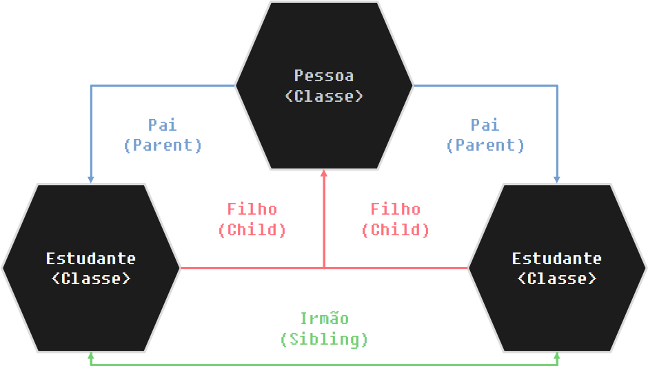

# Programação Orientada a Objetos Básica

A [programação orientada a objetos](https://pt.wikipedia.org/wiki/Programação_orientada_a_objetos) (POO em português e OOP em ingles) é um paradigma de programação que consiste na divisão do código em blocos independentes entre si.

Esses blocos são chamados de ***objetos*** e esses objetos contém *propriedades* (Atributos) e *metodos*, as propriedades consistem em valores (variaveis) pertinentes ao objeto principal, já os metodos consistem em funções que performam ações no objeto principal. *Os metodos podem ou não usar as propriedades em sua execução*.

Por exemplo, se fossemos representar uma pessoa, ela teria propriedades como:
- nome
- idade
- residencia

e teria metodos como:
- andar
- correr
- falar

para facilitar o entendimento, iremos fazer um simples estudante.

pense no seguinte exemplo:

nós temos um estudante com um nome, uma profissão (estudante) e que contem 5 notas e queremos calcular a média delas.

nós poderiamos representar este estudante como um dicionário, e usar `sum() / len()`.

> Nota: A Orientação a Objetos é um tópico muito complexo e confuso por si só, até mesmo as diferenciações de vocabulos basicos costumam confundir, tentarei simplificar o máximo sem perder conteudo.


```python
estudante = {
    "Nome": "Mirai",
    "Notas": [8.6, 9.3, 7.5, 8.8, 7],
    "Profissao": "Estudante"
}

media = sum(estudante["Notas"]) / len(estudante["Notas"])
print(f"O {estudante['Profissao']} {estudante['Nome']} tem média {media:.2f}")
```

    O Estudante Mirai tem média 8.24


nós poderiamos representar este mesmo estudante usando uma classe.

A sintaxe básica de uma classe é a seguinte:

```python
class {Nome}:
    def __init__(self):
        {codigo}
```

`class` -> é a keword de declaração de uma classe 

`{Nome}` -> o nome da classe

`def __init__(self):` -> um método especial, essencialmente, é executado toda vez que a classe é instanciada, é usado para guardar as propriedades dessa instancia.

`self` -> um parametro especial, se refere a classe em si

`{codigo}` -> o codigo para ser executado

uma classe pode ter `n` funções, basta declara-las normalmente.

vamos representar o nosso estudante como uma classe:


```python
class Estudante:
    profissao = "Estudante"         # esse é um Atributo de classe
    def __init__(self, nome, notas):
        self.notas = notas          # esse é um Atributo de Instancia
        self.nome = nome            # esse é um Atributo de Instancia


    def calcular_media(self):       # esse é um metodo
        self.media = sum(self.notas) / len(self.notas)


estudante_mirai = Estudante("Mirai", [8.6, 9.3, 7.5, 8.8, 7]) # estudante_mirai é um objeto instanciado da classe Estudante
estudante_joaquim = Estudante("Joaquim", [5.5, 3.8, 7.3, 4.5, 2.5]) # estudante_joaquim é um objeto instanciado da classe Estudante

estudante_mirai.calcular_media()
print(f"O {estudante_mirai.profissao} {estudante_mirai.nome} tem a media {estudante_mirai.media}")
```

    O Estudante Mirai tem a media 8.24


## Classe, Objetos e Instancias

em palavras simples: *Um Objeto é uma Instancia de uma Classe*.

agora vamos as explicações.

### Classes

*De acordo com a Wikipédia:*
> *Em programação e na orientação a objetos, uma **classe** é um Tipo abstrato de Dados (TAD); ou seja, uma descrição que abstrai um conjunto de objetos com características similares (um projeto do objeto), é um código da linguagem de programação orientada a objetos que define e implementa um novo tipo de objeto, que terão características (atributos) que guardaram valores e, também funções específicas para manipular estes.*

Essencialmente, uma classe é um "Template" de objeto, definindo os atributos e metodos.

### Objetos

*De acordo com a Wikipédia:*
> *Em programação orientada a objetos, a palavra **objeto** refere-se a um "molde"/classe, que passa a existir a partir de uma instância da classe. A classe define o comportamento do objeto, usando atributos (propriedades) e métodos (ações).*

Essencialmente, um objeto é uma manifestação independente de uma classe, tendo seus proprios valores para os atributos das classes.

### Instancias

*De acordo com a Wikipédia:*
> *Em programação orientada a objetos, chama-se instância de uma classe, um objeto cujo comportamento e estado são definidos pela classe.*

Essencialmente, As instancias são um conjunto de objetos com metodos e definições de atributos em comum.

Um resumo de tudo *de acordo com a Wikipédia:*
> *As instâncias de uma classe compartilham o mesmo conjunto de atributos, embora sejam diferentes quanto ao conteúdo desses atributos. Por exemplo, a classe "Empregado" descreve os atributos comuns a todas as instâncias da classe "Empregado". Os objetos dessa classe podem ser semelhantes, mas variam em atributos tais como "nome" e "salário".*

## Nomeação de parametros

no seguinte bloco de código:

```python
class Estudante:
    def __init__(self, nome, notas):
        self.notas = notas
        self.nome = nome
```

eu irei explicar a diferença entre o `self.notas` e o `notas` e consequentemente a diferença entre `self.nome` e `nome`.

o `self` se refere a classe `Estudante` em si, ou seja, quando fazemos `self.notas`, nós estamos criando um *atributo* chamado `notas` dentro da classe `Estudante`, e nós o associamos ao parametro `notas` da função especial `__init__()`

## Metodos Mágicos (Magic Methods/Dunder Methods)


Esses metodos também são chamados de "Metodos Especiais (Special Methods)" e "Dunder Methods"

Os Dunder Methods começam com dois `_` ()underscore) e terminam com 2 também, ex: `__init__`

aqui uma lista dos mais comumns:
- `__init__()` -> Executado assim que um novo objeto é instanciado.
- `__new__()` -> Executado para criar uma nova instancia de uma classe.
- `__call__()` -> Executado quando uma instancia é chamada como função.
- `__name__()` -> Retorna o nome da classe cujo o objeto foi instanciado.
- `__repr__()` -> Retorna uma string de representação da classe.

irei ressaltar todos exceto o `__new__()`, deixarei ele para quando aprendermos sobre `super()`

### `__init__()`

o `__init__()` é executado quando um objeto é instanciado, ele essencialmente serve para definir os atributos das instancias.

Exemplo:


```python
class Estudante:
    def __init__(self, nome, notas):
        self.notas = notas
        self.nome = nome

estd = Estudante("Mirai", [1, 2, 3])

print(estd.nome)
```

    Mirai


### `__call__()`

Essencialmente esse metodo é executado quando uma classe é executada como função.


```python
class Estudante:
    def __init__(self, nome, notas):
        self.notas = notas
        self.nome = nome
    
    def __call__(self):
        print(f"o estudante {self.nome} tem {self.notas} notas")

Estd_1 = Estudante("Mirai", [1, 2, 3])

Estd_1() # __call__ é executado
```

    o estudante Mirai tem [1, 2, 3] notas


### `__name__`

O `__name__` é usado quando queremos saber o nome da classe na qual o objeto foi instanciado, ou nome do módulo (mais a frente explicarei sobre).

exemplificarei o uso para classes.

Usando o `__name__` nativo das classes:


```python
class Estudante:
    def __init__(self, nome, notas):
        self.notas = notas
        self.nome = nome

print(Estudante)
print(Estudante.__name__)
```

    <class '__main__.Estudante'>
    Estudante


Veja que nós não precisamos inicializar um objeto, pois nós usamos o `__name__` nativo embutido em cada classe do Python.

Para definirmo
Definindo a função `__name__`:


```python
class Estudante:
    def __init__(self, nome, notas):
        self.notas = notas
        self.nome = nome
    
    def __name__(self):
        return self.__name__

Estd_2 = Estudante("Mirai", [1, 2, 3])

print(Estd_2.__name__)
```

    <bound method Estudante.__name__ of <__main__.Estudante object at 0x7f6c086d3ca0>>


Eu sei, é um pouco confuso mesmo, mas essencialmente ele está dizendo o que o `__main__` é:

`<metodo associado Estudante.__name__ de <Objeto __main__.Estudante em {endereço na memória}>>`

em outras palavras `self.__name__` diz o que é o `__main__` dele, usando a representação (`__repr__`) do objeto

> Sendo sincero, nunca cheguei a ter que definir o `__main__` diretamente, sempre usei o `__main__` nativo

### `__repr__`

O `__repr__` retorna uma string de representação do objeto quando usamos a função `repr()`.

quando omitimos a função ele usa um equivalente de tipo 'method-wrapper'

> NOTA: '\<method-wrapper\>' é usado no código fonte do Python para implementar funções escritas em C como um '\<unbound method\>', as explicações pra isso vão além do escopo desse capitulo, então não me aprofundarei.

Usando o `repr()` nativo das classes:


```python
class Estudante:
    def __init__(self, nome, notas):
        self.notas = notas
        self.nome = nome


Estd_2 = Estudante("Mirai", [1, 2, 3])

print(repr(Estd_2))
```

    <__main__.Estudante object at 0x7f6c084bdba0>


O `__repr__` retorna o endereço na memória de um objeto.

Definindo o `__repr__`:


```python
class Estudante:
    def __init__(self, nome, notas):
        self.notas = notas
        self.nome = nome

    def __repr__(self):
        return f"O Estudante {self.nome} é um objeto"
        

Estd_2 = Estudante("Mirai", [1, 2, 3])

print(repr(Estd_2))
```

    O Estudante Mirai é um objeto


## Herança (básica)

Finalmente chegamos a um importantissimo tópico em orientação a objetos, Herança (Inheritance).

Irei me ater aos básicos aqui, de forma resumida, _herança é a passagem/compartilhação de estados e metodos entre classes de forma hierarquica._

> Nota: 'estado' se refere as variaveis como um todo, conforme formos progredindo os vocábulos começarão a ficar robustos e eu passarei a usar termos mais 'tecnicos'.

Para nos referirmos a hierarquia e herança, usamos uma relação familiar (pai, filho, irmão, etc...)

a sintaxe é bem similar a vista anteriormente:

```python
class {nome}({classe pai}):
    def __init__(self, {variaveis da classe pai}):
        super().__init__({variaveis da classe pai})
```

`class {nome}({classe pai}):` -> A unica diferença é que especificamos a classe pai como argumento.

`def __init__(self, {variaveis da classe pai}):` -> além do `self` incluimos os parametros da função `__init__` da classe pai (se eles existirem)

`super().__init__({variaveis da classe pai})` -> passamos os parametros da função `__init__` do filho a função `__init__` do pai usando `super()`

para exemplificar criaremos uma classe `Pessoa` e faremos nossa classe `estudante` filha dela.


```python
class Pessoa: # Classe Pai
    def __init__(self, nome, idade):
        self.nome = nome
        self.idade = idade


    def apresentar(self):
        return f"Olá eu me chamo {self.nome} e tenho {self.idade} anos"


class Estudante(Pessoa): # Classe Filha
    def __init__(self, nome, idade, medias):
        super().__init__(nome, idade)
        self.medias = medias

    def calcular_medias(self):
        return sum(self.medias) / len(self.medias)


EstudanteA = Estudante("Mirai", 17, [8, 9, 7, 6, 8])    # EstudanteA é irmão de EstudanteB
EstudanteB = Estudante("Joaquim", 16, [5, 7, 3, 6, 9])  # EstudanteB é irmão de EstudanteA

print(EstudanteA.apresentar()) # Herdou da classe 'Pessoa'
print(EstudanteA.calcular_medias()) # Definida na classe 'Estudante'

print(EstudanteB.apresentar()) # Herdou da classe 'Pessoa'
print(EstudanteB.calcular_medias()) # Definida na classe 'Estudante'
```

    Olá eu me chamo Mirai e tenho 17 anos
    7.6
    Olá eu me chamo Joaquim e tenho 16 anos
    6.0


Veja que não precisamos definir `self.nome = nome` e `self.idade = idade` na classe `Estudante` pois essas propriedades são herdadas da classe `Pessoa`, juntamente com o método `apresentar`

a relação desses objetos é a seguinte:



Todas as instancias da classe `Estudante` são irmãs entre si (pois tem a mesma classe pai).

A classe `Estudante` é filha da classe `Pessoa`.

A classe `Pessoa` é pai da classe `Estudante`.

> NOTA: essas relações se extendem, ou seja, podemos ter classes netas, avós, tias, primas, etc...

### `super()`

*De acordo com a [documentação do Python](https://docs.python.org/3/library/functions.html#super)* (tradução livre):
> A função super() retorna um proxy de objeto que delega os metodos para uma classe pai ou irmã

basicamente, nos dá acesso aos metodos e atributos da classe pai.

ele também pode ser usado para instanciar um novo objeto, através do `__new__`

### `__new__`

O `__new__` é usado para criar um novo objeto, veja um exemplo:


```python
class Exemplo(object): # Herdamos a Classe base da hierarquia <object>
    def __new__(self):
        print("Criando Instancia (Instanciando)")
        return super(Exemplo, self).__new__(self) # Usamos a classe base para criar um novo objeto

    def __init__(self):
        print("Inicializando Instancia")

Exemplo()
```

    Criando Instancia (Instanciando)
    Inicializando Instancia


    <__main__.Exemplo at 0x7f6c08513430>


> NOTA: Novamente, eu nunca cheguei a precisar usar o `__new__` pessoalmente

## Introdução básica a Decoradores

um decorador é uma funcionalidade da linguagem que nos permite alterar o funcionamento de funções e classes. 

sua sintaxe é simples:

```python
@nome_do_decorador
```

e ele deve ser posto acima da função que deseja alterar.

> NOTA: Não irei me aprofundar muito, pois existe uma seção especifica para eles mais a frente.

Existem varios decoradores, mas irei ressaltar 3
- `@property`
- `@classmethod`
- `@staticmethod`

### `@property`

O `@property` serve para converter um metodo em atributo.

ele só funciona se o metodo tem apenas `self` como parametro e retorna alguma operação simples

voltemos ao nosso exemplo do estudante e calculo de notas:


```python
class Estudante:
    def __init__(self, nome, notas):
        self.notas = notas 
        self.nome = nome 


    def media(self):
        return sum(self.notas) / len(self.notas)


EstudanteExemplo = Estudante("Mirai", [1, 2, 3, 4, 5, 6, 7, 8, 9])

print(f"Media através do método: {EstudanteExemplo.media()}")
```

    Media através do método: 5.0


Veja que devemos executar o método para termos acesso a média, usando o `@property` nós convertemos esse metodo para um atributo, veja:


```python
class Estudante:
    def __init__(self, nome, notas):
        self.notas = notas 
        self.nome = nome 

    @property
    def media(self):
        return sum(self.notas) / len(self.notas)


EstudanteExemplo = Estudante("Mirai", [1, 2, 3, 4, 5, 6, 7, 8, 9])

print(f"Media através do atributo: {EstudanteExemplo.media}") # Omitimos a chamada da função
```

    Media através do atributo: 5.0


Porque isso? Bom, se você lembra, metodos devem ser usados para representar ações do objeto, e não para adicionar atributos, exemplificando:

_A média não é uma ação que nosso estudante faz, é um valor que ele possui, logo deve ser uma propriedade._

### Decoradores de metodos `@classmethod` e `@staticmethod`

os decoradores de metodos alteram os metodos para pegar parametros em especifico, até então estavamos usando os `instancemethod` através do `self`, esse metodo precisa de uma instancia para performar sua operação.

aqui nós temos a classe Estudante:

```python
class Estudante:
    def __init__(self, notas):
        self.notas = notas 

    def media(self):
        return sum(self.notas) / len(self.notas)
```

basicamente quando fazemos:

```python
EstudanteExemplo = Estudante([1, 2, 3, 4, 5, 6, 7, 8, 9])
EstudanteExemplo.media()
```

estamos essencialmente fazendo:

```python
EstudanteExemplo = Estudante([1, 2, 3, 4, 5, 6, 7, 8, 9])
Estudante.media(EstudanteExemplo.notas)
```

O metodo `media` usa a o objeto instanciado `EstudanteExemplo` para sua execução, ou seja, é um `instancemethod`

#### `@classmethod`

o `@classmethod` altera a função para usar a classe ao invés do objeto instanciado, veja o exemplo:


```python
class Foo:
    @classmethod
    def hi(cls):
        print(cls.__name__)

objeto = Foo()

objeto.hi()
```

    Foo


#### `@staticmethod`

o `@staticmethod` faz com que os metodos não precise de nenhum argumento, veja o exemplo:


```python
class Bar:
    @staticmethod
    def apresentar():
        print("eu sou um metodo com @staticmethod")

objeto_bar = Bar()

objeto_bar.apresentar()
```

    eu sou um metodo com @staticmethod

