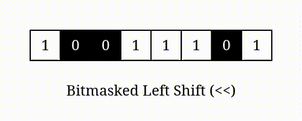

Programação é sobre resolver problemas e conceito usando as linguagens
Lembra da parte dos carro mine

Existem 2 tipos coiso o cara que é programador é aquele que vai sentar o CU dele vai começar a falar por que ele entende a merda que ele ta falando.
O cara que escreve o código ele é leva Block da própria mente em parte da criatividade

O HTML é o esqueleto e o CSS é a pele e a linguagem é o cérebro

A ÚNICA MATRIZ QUE A GENTE TEM CASSIFICAÇÂO È A DE PROGRAMAÇÔES

Imperativo --> Paradigma

Tipagem Forte --> um número vai um número na memória
Tipagem Fraca --> um número pode ser o que a memória quiser

Tipagem dinâmica: eu posso simplesmente somar "a = 2". resumindo linguaguem dinâmica é a linguagem que define o tipo das variáveis em tempo de execução.

Tipagem estática: não funfa, precisa especificar se não da ruim.Define o tipo das variáveis em tempo de compilação e o tipo deve ser espicificada em código.
 para abrir o python no terminal é só digitar " python3 " e pra sair é só colcar " exit() "

⣞⢽⢪⢣⢣⢣⢫⡺⡵⣝⡮⣗⢷⢽⢽⢽⣮⡷⡽⣜⣜⢮⢺⣜⢷⢽⢝⡽⣝
⠸⡸⠜⠕⠕⠁⢁⢇⢏⢽⢺⣪⡳⡝⣎⣏⢯⢞⡿⣟⣷⣳⢯⡷⣽⢽⢯⣳⣫⠇
⠀⠀⢀⢀⢄⢬⢪⡪⡎⣆⡈⠚⠜⠕⠇⠗⠝⢕⢯⢫⣞⣯⣿⣻⡽⣏⢗⣗⠏
⠀⠪⡪⡪⣪⢪⢺⢸⢢⢓⢆⢤⢀⠀⠀⠀⠀⠈⢊⢞⡾⣿⡯⣏⢮⠷⠁
⠀⠀⠀⠈⠊⠆⡃⠕⢕⢇⢇⢇⢇⢇⢏⢎⢎⢆⢄⠀⢑⣽⣿⢝⠲⠉
⠀⠀⠀⠀⠀⡿⠂⠠⠀⡇⢇⠕⢈⣀⠀⠁⠡⠣⡣⡫⣂⣿⠯⢪⠰⠂
⠀⠀⠀⠀⡦⡙⡂⢀⢤⢣⠣⡈⣾⡃⠠⠄⠀⡄⢱⣌⣶⢏⢊⠂
⠀⠀⠀⠀⢝⡲⣜⡮⡏⢎⢌⢂⠙⠢⠐⢀⢘⢵⣽⣿⡿⠁⠁
⠀⠀⠀⠀⠨⣺⡺⡕⡕⡱⡑⡆⡕⡅⡕⡜⡼⢽⡻⠏⠀
⠀⠀⠀⠀⣼⣳⣫⣾⣵⣗⡵⡱⡡⢣⢑⢕⢜⢕⡝⠀
⠀⠀⠀⣴⣿⣾⣿⣿⣿⡿⡽⡑⢌⠪⡢⡣⣣⡟⠀
⠀⠀⠀⡟⡾⣿⢿⢿⢵⣽⣾⣼⣘⢸⢸⣞⡟⠀
⠀⠀⠀⠀⠁⠇⠡⠩⡫⢿⣝⡻⡮⣒⢽⠋

<<<<<<< HEAD
Variável -> pode variar 
Constante --> não muda

Depois da # tudo vai ser ignorado,para ser um comentário 

int -> 300 12 
float -> 3.14

mas se eu mostrar o print (número1.type(número1))
print (número.type(número2))
floats não são recomendados para fazer contas
tipo
esse 10 -> endereço
23456 -> outro endereço

numero1 = 0.1
numero2 = 0.2

resultado 0.300000000000004
da um aperto nas memórias registradores e esses negócios

-------------------------------------------------====================------------------------------------------------------

 para colocar imagens

o módulo é o resto da divisão ele serve para retornar 6 % 2 vai dar 0 não vai dar exato 

Potência é exponesiado "**" 

#    BASE             OPERADOR             EXPOENTE
print(3                  **                    2)

Booleano = conjunto de lógica combinatória

curto circuito -> Diminuir o tempo em uma decisão

TC = Tipo composto
TC é qualquer tipo que tem mais de 1 dado
pode guarda 2 números, 4 palavras e etc...
- Tuples (Tulipas)
- Listas
- Sets
- Dicionarios

Mutabilidade: capacidade de um tipo ser alterado sem criar um novo.

Imultaveis

2 modos de declaração com () e ,
=======
>>>>>>> a87c62d6263198fdc5014121f6a6090df459c432
